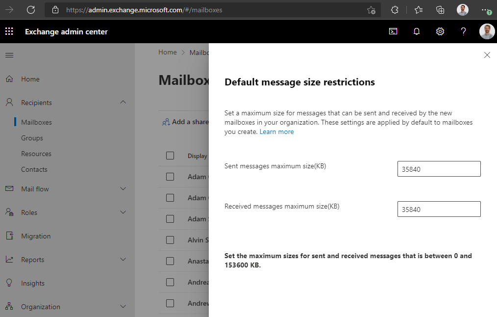
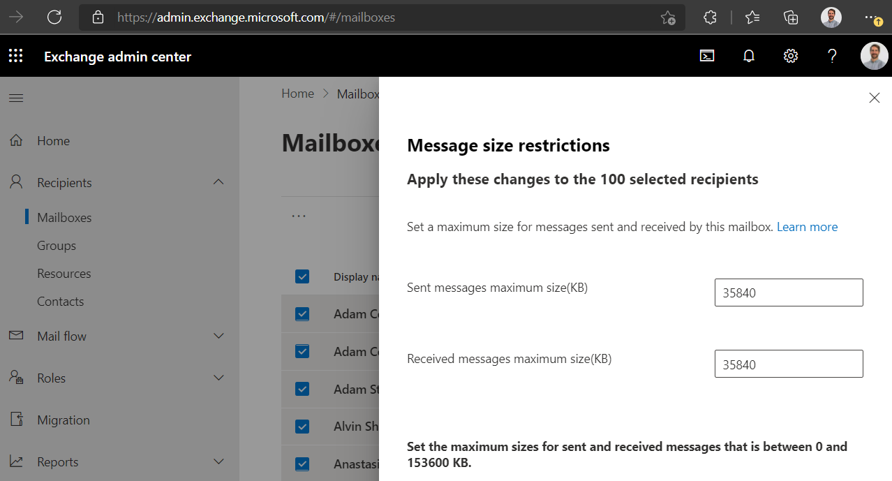

The default message size limit in Exchange Online is 25MB. Even though email attachments are not the best way to share a large file, sometimes it is the only option - and these days, 25MB is quite small. This default limit should be increased; it is easy to do so from the Exchange admin center or Exchange Management Shell.

<!--endintro-->

It is important to remember that the maximum email attachment size will also depend on the person receiving the email - their email service will need to accept the larger size. For example, Gmail's default limit is also 25MB.

### Changing the default in Exchange admin center

1. Go to **Exchange admin center | Recipients | Mailboxes | Set default message size restrictions**
2. Enter the maximum size you would like to set in KB for both sending and receiving, and click Save. We have it set to 35MB (35,840KB).



Note that this will only apply to new mailboxes. To change the restrictions for existing mailboxes, from the same page you can select one, several or all existing mailboxes, and click **Message size restrictions.** As above, enter the desired maximums and click Save.



### Changing message limits in Exchange Management Shell

Of course, this can also be done with the Exchange Management Shell, for example:

<!--StartFragment-->

```bash
Set-Mailbox -Identity "Adam Cogan" -MaxSendSize 35mb -MaxReceiveSize 35mb
```

<!--EndFragment-->

- - -

### Links

[Exchange Online limits - Service Descriptions | Microsoft Docs](https://docs.microsoft.com/en-us/office365/servicedescriptions/exchange-online-service-description/exchange-online-limits#message-limits)

[Configure message size limits for a mailbox | Microsoft Docs](https://docs.microsoft.com/en-us/exchange/recipients/user-mailboxes/mailbox-message-size-limits?view=exchserver-2019)
