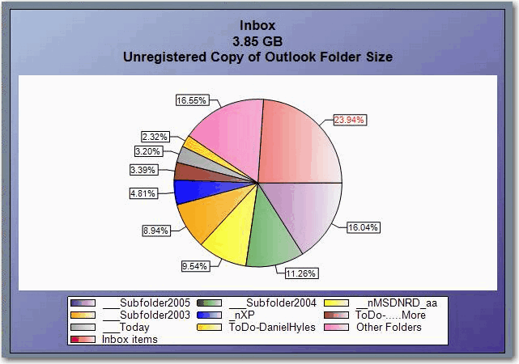
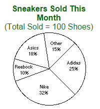
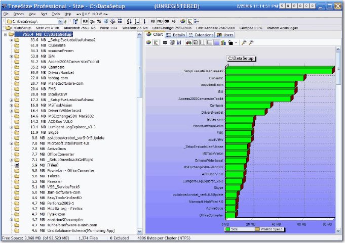

<blockquote>
<strong>Line graph</strong> Line graphs are used to track changes over short
 and long periods of time. When smaller changes exist, line graphs are 
better to use than bar graphs. Line graphs can also be used to compare 
changes over the same period of time for more than one group.

<strong>Pie Chart</strong> Pie charts are best to use when you are trying to compare parts of a whole. They do not show changes over time.

<strong>Bar Graph</strong> Bar graphs are used to compare things between 
different groups or to track changes over time. However, when trying to 
measure change over time, bar graphs are best when the changes are 
larger.

                    <a href="https://nces.ed.gov/nceskids/help/user_guide/graph/whentouse.asp">https://nces.ed.gov/nceskids/help/user_guide/graph/whentouse.asp</a> 
                </blockquote>
This is a fancy way of saying use the right graph for
 the right purpose. Pie graphs fulfill a specific requirement, unlike a 
bar graph which is more multi-purpose.

 <excerpt class='endintro'></excerpt> 

Pie graphs are used to show the general composition of an element. It's good for seeing at a glance what section is dominating, but it doesn't handle details very well.
<dl class="badImage"><dt> 
       
   </dt><dd> Figure: Bad Example - This Pie Graph is too complicated and difficult to understand.</dd></dl><dl class="goodImage"><dt> 
       
   </dt><dd> Figure: Good Example - This Pie Graph has been simplified and it is easy to see at a glance that Nike sold the most sneakers this month compared to others.</dd></dl><dl class="goodImage"><dt> 
       
   </dt><dd> Figure: Good Example - This Bar Graph data hasn't even been processed but it's still readable.</dd></dl>

