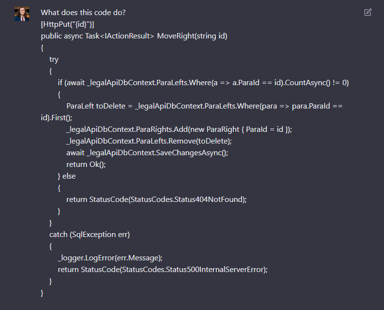
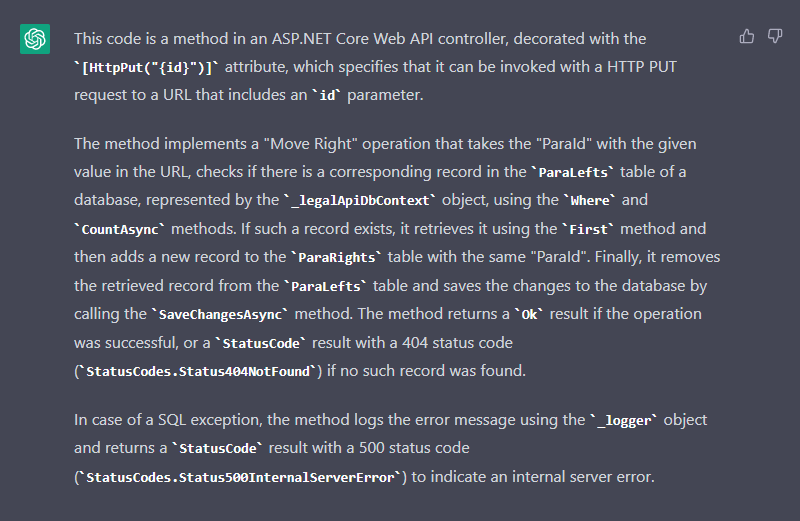

ChatGPT is an extremely useful tool for software developers as it has been trained to understand how code functions. It will provide an invaluable alternative to StackOverflow, being a great resource to help developers troubleshoot.

ChatGPT can be used for:

* Detecting bugs in your code
* Solving compile time or runtime errors
* Generating code based on a text description 
* Explaining how a piece of code works
* Translating code to a different language (e.g. Python code to C#)
* Minimising generation of boilerplate (e.g. JSON to C# classes)
* Helping automate the code refractoring process
* Helping perform code reviews

⚠️Warning: However, ensure you double check code integrity before deploying to production!

