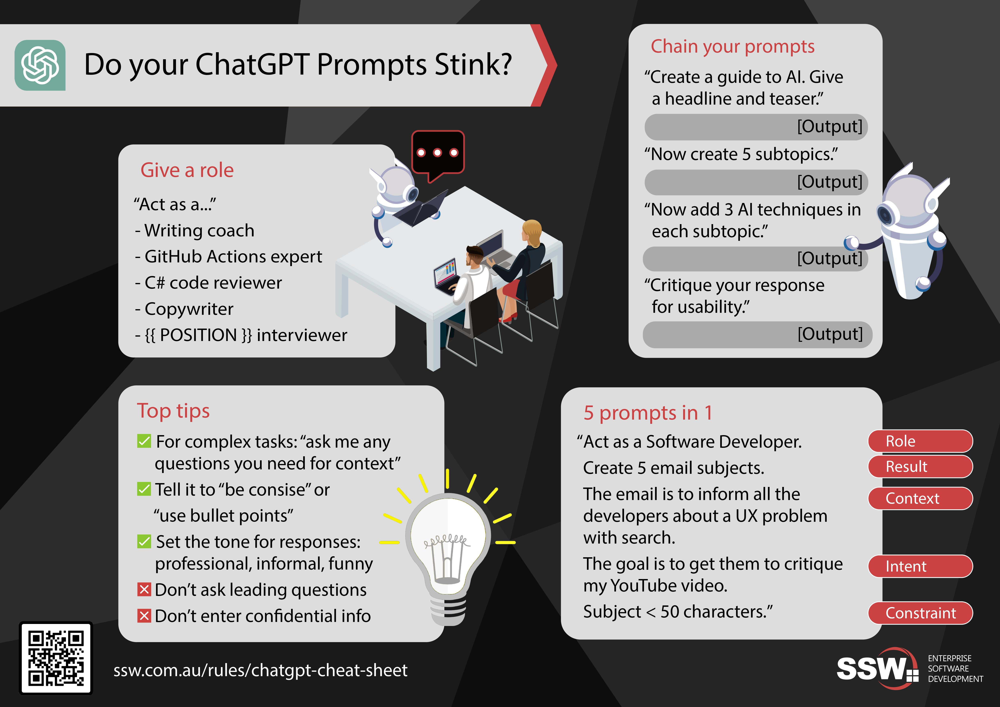

As ChatGPT becomes increasingly popular, users are discovering the most effective ways to prompt the AI for different scenarios. One way to compile this information is by putting it in easy to read graphics called cheat sheets. Cheat sheets can spark ideas that you would not have otherwise thought of!  
        
<!--endintro-->

::: greybox
**Tip:** You can use ChatGPT to find a courteous and fun way to [correct somebody's mistake](/is-everyone-in-your-team-a-standards-watchdog).
:::
