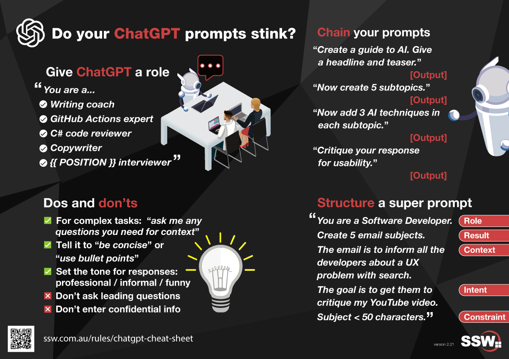

As ChatGPT becomes increasingly popular, users are discovering the most effective ways to prompt the AI for different scenarios. One way to compile this information is by putting it in easy to read graphics called cheat sheets. Cheat sheets can spark ideas that you would not have otherwise thought of!  

<!--endintro-->

 
<strong>Figure: SSW ChatGPT Cheat Sheet - [Download here](ChatGPT-Cheat-sheet-Bathroom-Door-v2.pdf)</strong>

 
<strong>Figure: SSW ChatGPT Cheat Sheet For Developers - [Download here](ChatGPT-Cheat-Sheet-Devs-v2-2.pdf)</strong>

::: greybox
**Tip:** You can use ChatGPT to find a courteous and fun way to [correct somebody's mistake](/is-everyone-in-your-team-a-standards-watchdog).
:::

Here are examples of the prompting techniques on the cheat sheet: 

## Give a role

::: greybox
*You are a... 🤖* 
:::

ChatGPT can be given a role to understand the context of what it will need to do/know. 

See some examples below: 

::: greybox

*...writing coach: How can I improve the clarity and impact of this project proposal?"*

*...GitHub Actions expert: "What's the best way to set up a CI/CD pipeline using GitHub Actions?"*

*...C# code reviewer: "Please review this C# code snippet for a new feature implementation."* 

*...Copywriter: "Help me write a catchy headline for our new marketing campaign."*

*...{{ POSITION }} interviewer: "Act as a UX Designer interviewer and ask me 5 relevant questions."*
:::

## Some dos ✅

* For complex tasks, use: *"ask any questions needed for context"* 

::: greybox
*"Design a new feature for our mobile app and ask me any questions for context."*
:::

* Tell it to *"be concise"* or *"use bullet points"* 

::: greybox
*"Summarize the benefits of using React in our project, and please be concise. Use bullet points with pros and cons."*
:::

* Set the tone for responses (e.g. professional, informal, funny)

::: greybox
Professional: *"Explain the importance of code reviews in a professional tone."* 

Informal: *"In an informal tone, tell me why UX design matters for our app."* 

Funny: *"Share a funny anecdote about a marketing campaign that went wrong."*
:::

## Some don’ts ❌

* Don't ask leading questions. Don’t anchor ChatGPT. 

::: greybox
*“Isn't Python the best language for this project?"*
:::
::: bad
Bad example
:::

::: greybox
*"What language would be best for this project and why?"*
:::
::: good
Good example
:::

* Don’t share confidential information with ChatGPT   

According to Forbes, any data shared with ChatGPT could end up being leaked since the data becomes part of a collective database. 

## The anatomy of a prompt - 5 prompts in 1 🫀

It’s important to consider what a prompt is made up of. Here’s an example that breaks down the different components of a good prompt: 

* **Role** - *You are a Software Developer.*  
* **Result** - *Create 5 email subjects.*
* **Context** - *The email is to inform all the developers about a UX problem with search.*  
* **Intent** - *The goal is to get them to critique my YouTube video.*  
* **Constraint** - *Subject < 50 characters.* 

For more on this prompt structure, see: [Do you know the fundamentals of Prompt Engineering?](/fundamentals-of-prompt-engineering)

## Chain your prompts

Chain prompting is the technique of guiding GTP's responses by asking a series of related questions or prompts, building upon the previous answers to obtain more coherent and relevant information. 

For an example on this, see: [Do you use chained prompting?](/chained-prompting)
