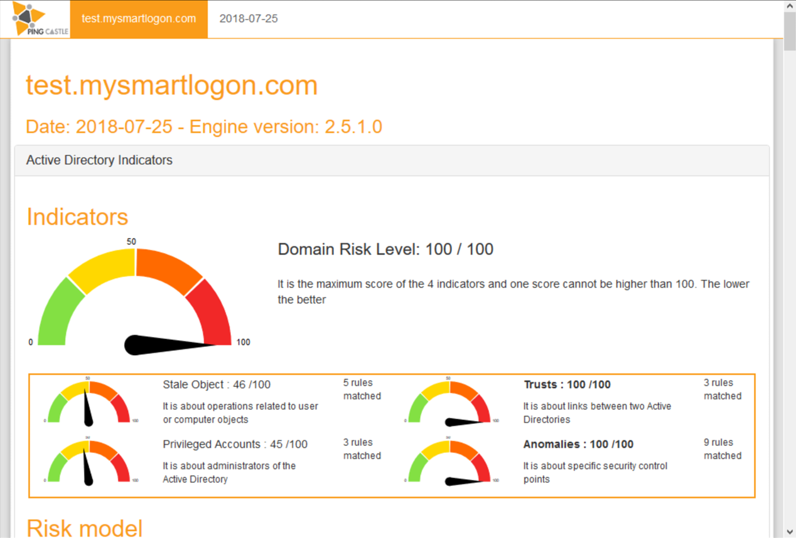
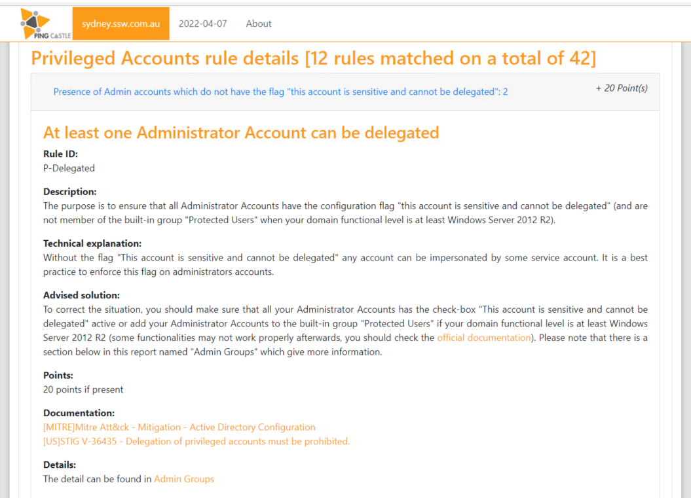

> "Active directory is quickly becoming a critical failure point in any big sized company, as it is both complex and costly to secure..." - PingCastle

[PingCastle](https://www.pingcastle.com/) is an Active Directory auditing tool. It checks your accounts, computers and configuration in AD and gives you a great report on things that should be addressed. It is a tool that should be run periodically - we do it every 3 months - to keep AD secure.

<!--endintro-->

PingCastle is easy to install and run - see [their documentation](https://www.pingcastle.com/documentation/) for more information. It is free to use in your own environment, or there are paid versions for MSPs and larger enterprises.

Once you have run it, you get a great report on your Active Directory security health, with detailed recommendations of what you need to fix.

