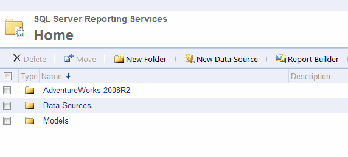

<!--endintro-->

SQL Server 2008 R2 Reporting Services comes with some great samples that will help get you started. Unfortunately, they aren't installed by default.

These samples include:

1. Report Project based on the Adventure Works 2008 R2 database
2. Report Builder Model based on the Adventure Works 2008 R2 database

Upon installing the samples successfully, you should see 3 folders (shown below) in your Report Manager.

For more information, visit the following links:

* [AdventureWorks sample databases](https://learn.microsoft.com/en-us/sql/samples/adventureworks-install-configure?view=sql-server-ver16&tabs=ssms)

* [Samples for Reporting Services](https://github.com/microsoft/sql-server-samples/tree/master/samples/features/reporting-services)

* [AdventureWorks Sample Reports](https://www.ssw.com.au/ssw/Standards/AdventureWorksSamples.aspx)
