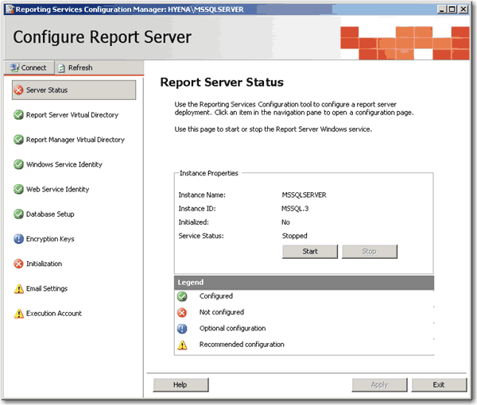
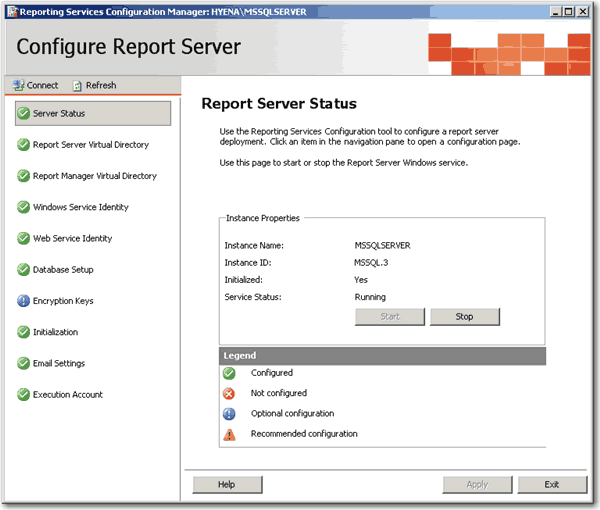
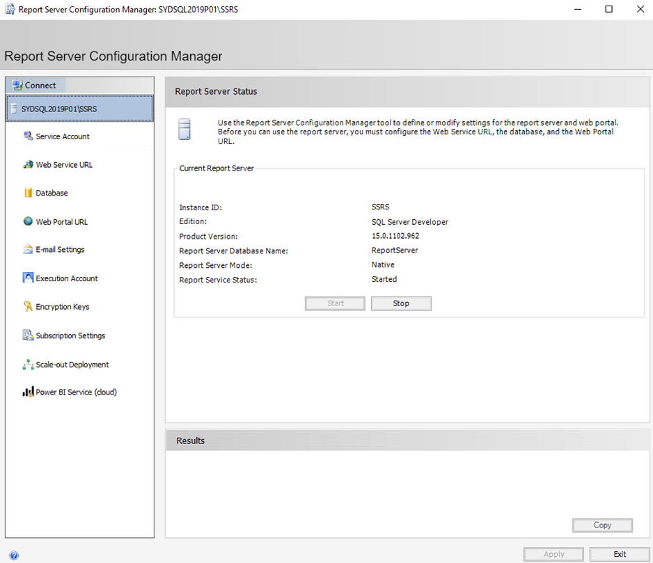

<!--endintro-->

To ensure your Reporting Services is running in a healthy state, you need to check if you have all the green ticks in your "Report Server Configuration Manager".

::: bad  
  
:::

::: good  
  
:::

::: good  
  
:::

Note: "Report Server Configuration Manager" is only available in SQL Server 2005.
