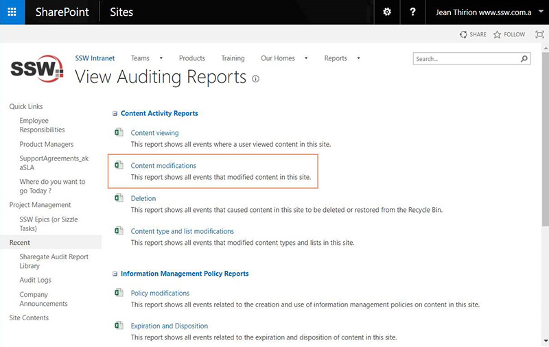
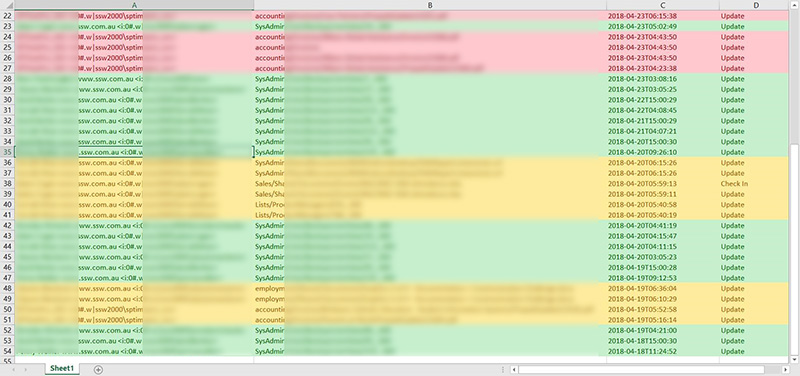

During the migration the site can't be locked if you are [using Sharegate](https://sharegate.com/sharepoint-migration), there is a chance that employees will ignore the instructions in the ribbon and still make changes.

Furthermore, they might also be automated processes that are putting records in your old SharePoint Server.

So to ensure the migration process did not miss any items, ensure nobody modified documents on your old Intranet SharePoint Server. To do that:

<!--endintro-->

1. Navigate to "Site Settings" | "Audit log reports" which will take you there:  

  

2. Click "Content Modifications"
3. Order the generated Excel data by modification date ("Occurred" ) and look for modifications done by users.
4. Chase the people who did the modifications and ask them either to: 
    * Redo their modification in your new Cloud intranet (likely)
    * Confirm that the modification is not important and does not require manual migration (less likely)

::: email-template  
|          |     |
| -------- | --- |
| To:      | John |
| Cc:      | YYY |
| Subject: | Changes to yyy file |  
::: email-content  

### Hey John,

I have noticed that you changed the file “yyy” \[add link to the file\].

Could you please:

1.	Let me know what were the changes?
2.	Tell me why you did these changes (task, etc...)?

Please note that these changes will be lost as part of the old SharePoint server decommission. If the changes are important, please redo the modifications on the new Online Intranet.

Regards,
- SharePoint Admin Team  

:::  
:::  

After you export to Excel, follow this example:

  

- **Green:** non-important data (automated logging info) - ignore
- **Orange:** potentially important data (user made changes) – ask the user
- **Red:**  critical data (invoices !) – Migrate these documents
