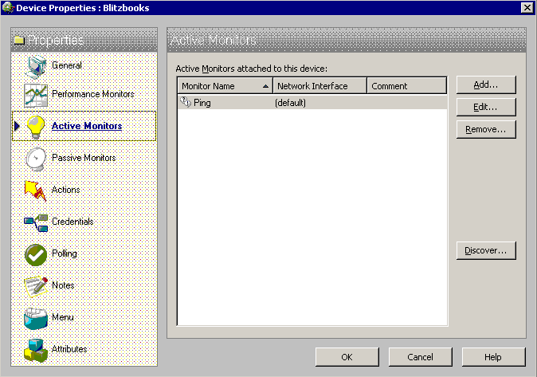
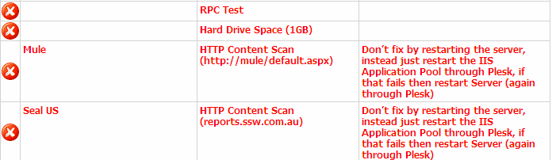

If you want to know your website is working or not, you need to add a ping check to the machine also an HTTP Content Scan to the website in WhatsUp. We use WhatsUp to do real-time monitoring.
Follow these steps to check your website in WhatsUp:
<!--endintro-->

1. Add your website as a new device. 
  

2. Ping monitor is added automatically. 
  

3. Add an HTTP Content Scan monitor. 
  

4. Edit the scan script. In the script, you can see 2 keywords "Send" and "Expect".
"Send" expression is an  HTTP request to your website.
"Expect" expression is a regular expression to check the key word in response from your website.
 
  

5. Add the monitor to your device. 
  
 Once a device is down or up, a WhatsUp action will tell SQL Reporting Services to send out a notification report. 
Our report looks like this: 
  

