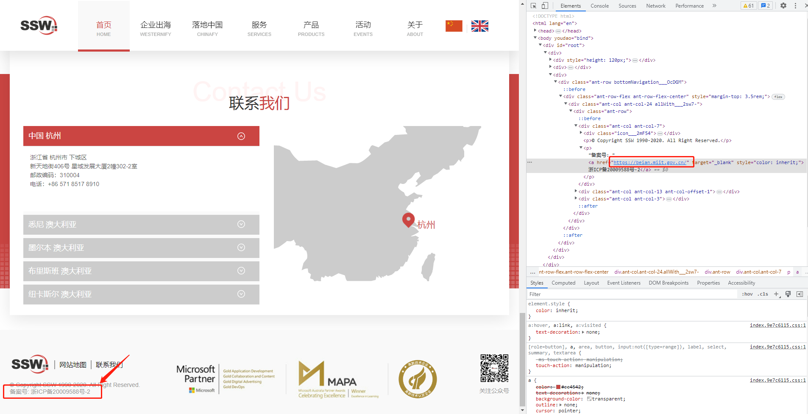
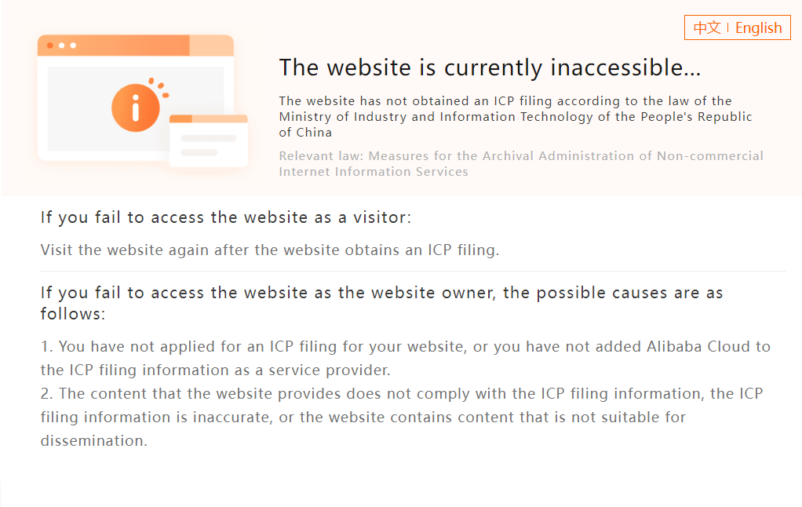

If you want to deploy your App to China and you want to use a domain name to access it, <mark>**ICP filing is required**</mark>. ICP requires some paperwork to prove the domain belongs to you.

ICP (Internet Content Provider) filing is for non-commercial websites that are purely informational and provide information free of charge. It shows as **浙ICP备20009588号**, **"浙"** represents Zhejiang.

**It typically includes the following:**
- The website owner must be a resident or enterprise of mainland China.
- The website owner needs to provide valid identification and contact information.
- The website's content must comply with the Chinese government's censorship standards and may not disseminate illegal or harmful information.
- The website needs to display the ICP filing number on the website for verification by users and government agencies.

**Related term:**
- [Administrative Measures for the Recordation of Non-commercial Internet Information Services](https://www.wayaglobal.com/icpknowledge1.html)

::: good

:::

::: bad

:::
