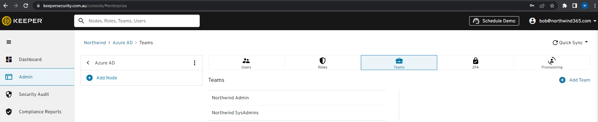
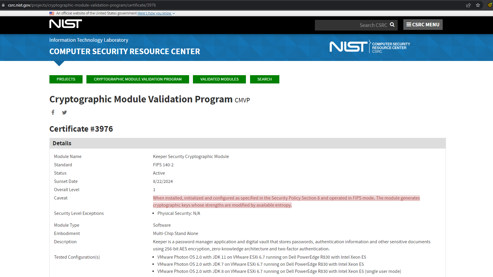
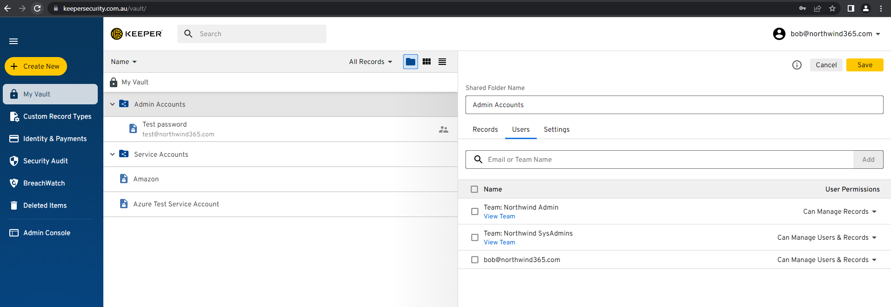
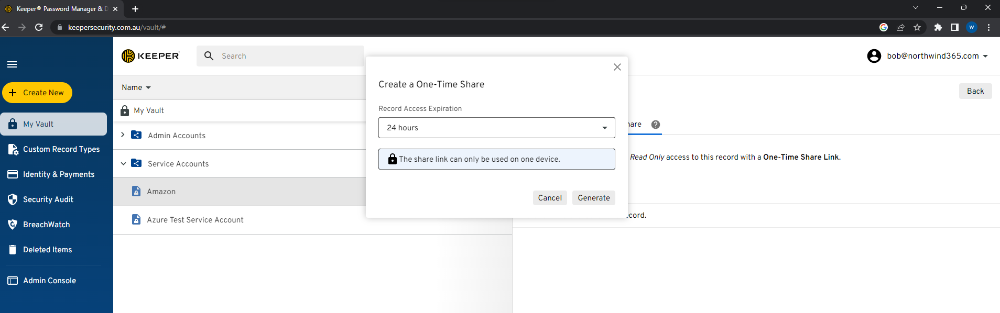
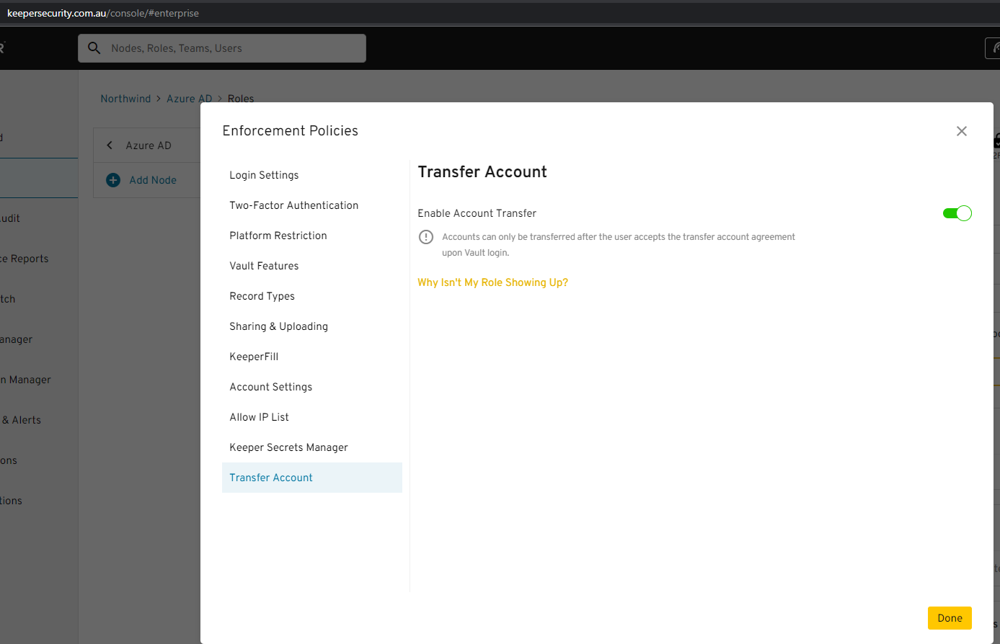
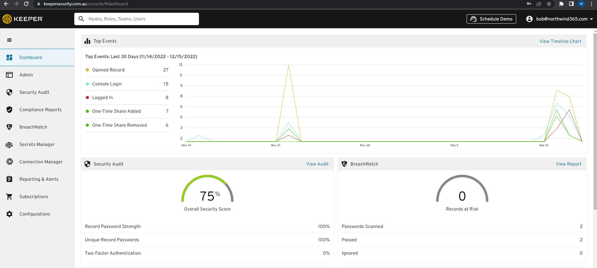

`youtube: https://www.youtube.com/embed/JnjVvS2Lw7M`
**Video: Do you know how to choose an Enterprise Password Manager? | [Warwick Leahy](https://ssw.com.au/people/warwick-leahy/) | SSW Rules (5 min)**

Most organizations store lots of passwords. There is often a need to share these passwords with other staff and these passwords all need to be unique, long and complex. This can all be resolved by using a high quality Enterprise Password Manager. There are a lot of password managers on the market so what features are essential.  

These are must have features:

<!--endintro-->

1. **Single sign on with Azure AD** - It would be ironic for a password manager to require staff to remember another password when the intent is to stop them remembering passwords, so it is essential that a good password manager leverages your existing security information. Also with Azure AD staff already have security groups, they already have MFA and access to very advanced conditional access policies, such as impossible travel and trusted devices.

   A good Enterprise Password Manager should take advantage of all the same policies. Also by using auto-provisioning they will automatically gain access to the passwords that an administrator gives them access to when a user is created and given the correct security group access and more importantly lose access to passwords when an account is disabled or they are removed from a security group.

   ::: good
   
   :::
2. **Secure and certified** - All good password managers should use AES 256-bit encryption and PBKDF2 - generally accepted as being the most secure. This should be certified by an organization like NIST.

   ::: good
   
   :::
3. **Internal password sharing** - This should be low overhead. Once a user is synced with their groups form Azure they should automatically have access to all of the passwords that they require in the password manager.

   ::: good
   
   :::
4. **External password sharing** - In the past passwords could be shared using an online service such as onetimesecret.com but that always comes with a risk.  That online service could be compromised. A good password manager should allow One-Time sharing from inside the password manager.

   ::: good
   
   :::
5. **Administrative control** - In the event of a staff member leaving an Administrator should be able to take control of the leaving staff members account. It is easy for a staff member to create a password and not add it to a shared folder. When they leave an Administrator needs to be able to check those passwords and keep any passwords that might be required by the organization. All good Enterprise Password Managers provide free family plans for their staff so none of these passwords should be personal.

   :::good
   
   :::
6. **Reporting** - Good reporting is essential. Easily checking that all the passwords used in the organization are unique and also complex is very important.  Not only that but if a login has been compromised and released on the dark web then it's important that an Administrator is notified about it and can act on it.

   ::: good
   
   :::
