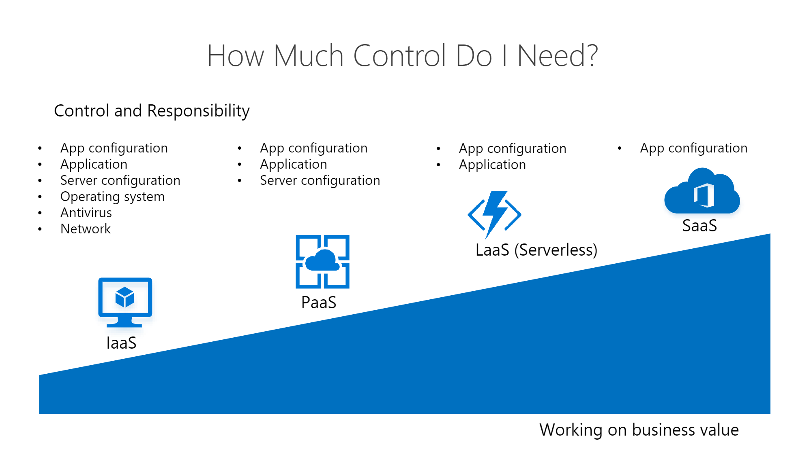

Getting application architecture right is super hard and often choosing the wrong architecture at the start of a project causes immense pain further down the line when the limitations start to become apparent.

[Azure has 100s of offerings](https://azure.microsoft.com/services) and it can be hard to know what the right services are to choose for any given application.

However, there are a few questions that [Azure MVP Barry Luijbregts has come up with](https://github.com/bmaluijb/HowIChooseMyAzureServices/blob/master/How%20I%20choose%20which%20services%20to%20use%20in%20Azure.pdf) to help narrow down the right services for each business case. 

<!--endintro-->

`youtube: https://www.youtube.com/watch?v=ZpK_lv6HJkQ`
**Video: How to choose which services to use in Azure | Azure Friday**

There are 2 overarching questions to ask when building out Azure architecture:

## 1. How do you run the app?

Azure offers heaps of models for running your app. So, to choose the right one you need to break this question down into 3 further parts:

### 1.1 Control - How much is needed?

There are many different levels of control that can be provided. From a VM which provides complete control over every aspect, to an out-of-the-box SaaS solution which provides very little control.

Keep in mind, that the more control you have, the more maintenance will be required meaning more costs. It is crucial to find the sweet spot for control vs maintenance costs - is the extra control gained actually necessary?

* Infrastructure as a Service (IaaS)

  * Consumer responsible for everything beyond the hardware

    e.g. Azure VM, AKS
* Platform as a Service (PaaS)

  * Consumer responsible for App configuration, building the app and server configuration

    e.g. Azure App Service
* Logic as a Service (LaaS)

  * Consumer responsible for App configuration and building the app

    e.g. Azure Functions, Azure Logic Apps
* Software as a Service (SaaS)

  * Consumer responsible for only App configuration

### 1.2 Location - Where do I need the app to run?

Choosing where to run your app 

* Azure 
* On-Premises
* Other Clouds e.g. AWS, Netlify, GitHub Pages
* Hybrid

### 1.3 Frequency - How often does the app need to run?

Evaluating how often an app needs to run is crucial for determining the right costing model. A website or app that needs to be available 24/7 is suited to a different model than something which is called infrequently such as a scheduled job that runs once a day.

There are 2 models:

* Runs all the time

  * Classic (Pay per month) e.g. Azure App Service, Azure VM, AKS
* Runs Occasionally

  * Serverless (Pay per execution) e.g. Azure Functions, Azure Logic Apps

## 2. How do you store your data?

Azure has tonnes of ways to store data that have vastly different capabilities and costing models. So to get it right, ask 2 questions.

### 2.1 Purpose - What will the data be used for?

The first question is what is the purpose of the data. Data that is used for everyday apps has very different storage requirements to data that is used for complex reporting.

So data can be put into 2 categories:

* Online Transaction Processing (OLTP)

  * For general application usage e.g. storing customer data, invoice data, user data etc
* Online Analytical Processing (OLAP)

  * For data analytics e.g. reporting

### 2.2 Structure - What type of data is going to be stored?

Data comes in many shapes and forms. For example, it might have been normalized into a fixed structure or it might come with variable structure.

Classify it into 2 categories:

* Relational data e.g. a fully normalized database
* Unstructured data e.g. document data, graph data, key/value data

## Example Scenario

These questions can be applied to any scenario, but here is one example:

Let's say you have a learning management system running as a React SPA and it stores information about companies, users, learning modules, learning items. Additionally users can upload rich text notes or images about each module as needed.

It also has a scheduled job that runs daily, picks up all the user data and puts it into a database for reporting. This database for reporting needs to be able to store data from many different sources and process billions of records.

### Q1: The App - Where to run the app?

**Control** - The customer doesn't need fine tuned control but does need to configure some server settings for the website.

**Location** - The app needs to run in Azure.

**Frequency** - The scheduled job runs occasionally (once a day...) while the website needs to be up all the time.

### A1: The App - The best Azure services are

* An Azure App Service for the website, since it is a PaaS offering that provides server configuration and constant availability
* An Azure function for the scheduled Job, since it only runs occasionally and no server configuration is necessary

### Q2: Data - How to store it?

**Purpose** - The data coming in for everyday usage is largely transactional while the reporting data is more for data analytics. 

**Structure** - The data is mostly structured except for the rich text notes and images.

### A2: Data - The best Azure Services are

* Azure SQL for the main everyday usage
* CosmosDB for the rich text notes and images
* Azure Synapse for the data analytics