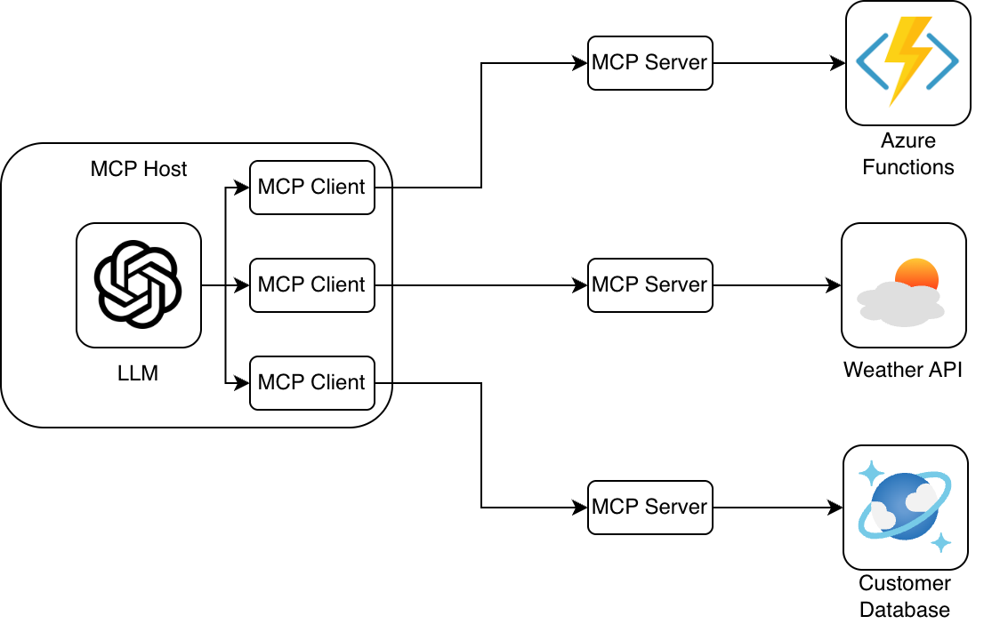

Choosing the right language for your Model Context Protocol (MCP) project can feel like riding the highway to decision fatigue. You’re inundated with options, but the onus is on you to pick one that truly suits your needs.
In this rule, we’ll discuss how to choose the right language for your MCP clients and servers, saving you unnecessary pain down the line.

<!--endintro-->

## What are MCP clients and servers?

MCP (Model Context Protocol) defines a standard way for large language models (LLMs) to interact with external tools and data sources. It does this through two key components: MCP clients and MCP servers.

### MCP Clients

An MCP client acts as a bridge between the language model and the services exposed by an MCP server.

Essentially, your MCP client treats your MCP server as a functional dependency.
The language your client is written in can be completely different from your server, they simply communicate via the JSON-RPC protocol.

### MCP Servers

An MCP server hosts the actual tools and services that an LLM can use through an MCP client.
Because the two components communicate via a standard protocol, you can implement your server in any language that can handle JSON-RPC requests.

### Supported SDKs

As the ecosystem is evolving quickly, we recommend choosing a language with an actively maintained SDK or community supported library.

Official SDKs currently exist for the following languages:

* [TypeScript](https://github.com/modelcontextprotocol/typescript-sdk)
* [Python](https://github.com/modelcontextprotocol/python-sdk)
* [Java](https://github.com/modelcontextprotocol/python-sdk)
* [Kotlin](https://github.com/modelcontextprotocol/kotlin-sdk)
* [C#](https://github.com/modelcontextprotocol/csharp-sdk)
* [Go](https://github.com/modelcontextprotocol/go-sdk)
* [PHP](https://github.com/modelcontextprotocol/php-sdk)
* [Ruby](https://github.com/modelcontextprotocol/ruby-sdk)
* [Rust](https://github.com/modelcontextprotocol/rust-sdk)
* [Swift](https://github.com/modelcontextprotocol/swift-sdk)

## The Right Language for Creating MCP Clients

When choosing a language for your MCP Client, you should prioritise SDK stability and ecosystem support. The MCP community has official SDKs for multiple languages, and these libraries can be used to create both clients and servers.

### Recommended Language: Python

At SSW, we’ve found Python to be the most stable and reliable choice for creating MCP clients. The official SDK is mature, easy to work with, and has strong community support making it an excellent option for most MCP integrations.

### Other Options

We generally recommend .NET for building APIs and enterprise-grade applications. However, in our experience, the official C# MCP library is still evolving, and the developer experience isn’t yet on par with Python.

## The Right Language for Creating MCP servers

In our experience we've found that the stability issues with the libraries mainly arise when creating an MCP client. Because the client and server operate independently, you’re free to choose different languages for your server. The considerations for choosing a language for your MCP server will be fairly standard reasons for why you'd choose the language in other scenarios, such as:

- Integration with your existing systems
- Performance requirements
- Developer familiarity and maintainability
