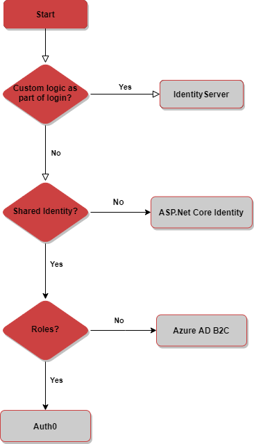
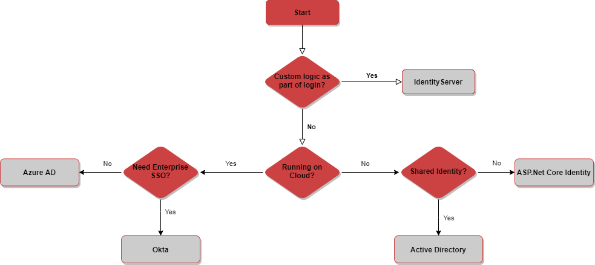

Authentication and authorization are complicated, and it is risky to try and implement them yourself. Use this rule as a guide on choosing the right service or framework for your situation.

::: img-small  
  
:::  

<!--endintro-->

Choosing the right [authentication and authorization](https://www.youtube.com/watch?v=i0d9iTmWIOw) approach for your situation can be tricky. It is a multi-faceted problem with many variables, and what seems like the right choice in one situation may not be in the other.

### Start with the Questions

1. **Scope** - Is it an enterprise application for internal users or a consumer application for external use?
2. **Social** - Do you need to support   
      - [OAuth2](https://oauth.net/2) or 
      - [OIDC](https://openid.net/connect)?
3. **MFA** - Do you need to support   
      - [MFA](https://en.wikipedia.org/wiki/Multi-factor_authentication)?
4. **Scope** - Do you need to share the identity across multiple applications?
5. **Volume** - Do you have an estimate for how many users you need to support?
6. **Complexity** - do you need custom logic to run as part of your authentication process?

Without the answers to these questions, it will be difficult to choose the right option. With the answers to these questions, you can use the flow charts below to help you choose the right solution.

Your situation is unique, and every application's requirements are different. These flow charts are intended to point you towards what you should consider for your solution.

###  External Applications

External applications are B2B or B2C applications that are intended for consumption outside of your organization.

  

#### Example Template to Customer:

::: greybox
 **Scenario:** 
 
Scope - You are building a consumer facing service that will have multiple clients, including a [SPA](https://docs.microsoft.com/en-us/archive/msdn-magazine/2013/november/asp-net-single-page-applications-build-modern-responsive-web-apps-with-asp-net) and a mobile app.     
Social - You want to allow your users to sign up with their social identities (Google, Facebook, Twitter, etc.) but want to allow them to create an account with you if they don't have a social login or don't want to use it.     
All users will have the same level of access once logged in.     
Volume - You anticipate 20,000 active users.     
MFA - You would like to allow users to enable MFA.     

**Your choices:**   

- **Option A** <mark>(Recommended)</mark> - Azure AD B2C  - B2C provides all of the functionality you need and is free for up to 50,000 monthly users.  
- **Option B** - Auth0 - Auth0 will meet most of these requirements, however, your volume of users will exceed the free tier and you don't need the additional functionality of the paid tier.     
- **Option C** - Identity Server - This would work but adds additional management overhead and complexity. You would also need to manage scaling to cope with your volume of users.

:::
::: good
Good example: The chosen solution meets the requirements and is highlighted as per [Do you manage up?](/do-you-manage-up)
:::

###  Internal Applications

For internal applications, the below flow chart is intended to assist your decision by guiding you to which option or options to consider for your application. It is possible (and in some cases necessary) to use combinations of these.

  

#### Example Template to Customer:

::: greybox
**Scenario:**   

Scope - You have an internal enterprise application, which will support approximately 1,000 users.     
You already have Active Directory in place and are syncing with an Azure AD tenant.     
Your users will need to access this application from anywhere.     
MFA - As per your company security policy, you must enforce MFA.     

**Your choices:** 
- **Option A** <mark>(Recommended)</mark> - Azure Active Directory - most of the infrastructure for this is already in place for you, and it already meets all your requirements. We would just need to wire up your application to it.
- **Option B** - Active Directory - while your users are already in AD, it doesn't give you MFA or access outside your network.
- **Option C** - Okta - this is an expensive option which for this scenario, doesn't provide any advantages over Azure AD.
:::
::: good
Good example: The chosen solution meets the requirements without adding unnecessary additional costs  
:::

**Note #1**: All of the following options assume you are building an ASP.NET Core application, although the commercial options listed here provide libraries for most development languages, frameworks, and platforms.

**Note #2**: The information here is relevant as provided, but consider other factors that may impact your decision too. For example, cost may be a factor and saving money may be more important than the added benefits of higher-cost options. Additionally, your situation may not fit neatly into one of the scenarios we have listed and may span multiple scenarios, in which case you may need to pick the option which caters to the broadest set of requirements (avoid 'mix and match').

### ASP.NET Core Identity (simple and free)

ASP.NET Core has some built-in identity functionality that allows you to create users and roles, and manage the security of your web applications. It is extremely capable and can be used to support a broad number of scenarios. However, it is intended for use in simple web applications, and while it can be extended to support other clients, you will need to build and wire up a lot of the UI for these scenarios yourself. Your identity store will be limited to this one application, so your users will not be able to share this identity across multiple applications.

::: good
Advantages:
:::

* Free
* Easy to set up and use
* Supports OAuth2/OIDC providers

::: bad
Disadvantages:
:::

* It is recommended by Microsoft that for advanced requirements you don't use this on its own - so need to add one of the below
* Does not scale well across multiple applications - so need to add one of the below
* For anything other than an ASP.NET Core Web app (e.g. Angular, React, or mobile), you have to build all UI yourself, such as: sign up, log, password reset, etc.

**Use this option if...**

* You need to add identity to a simple ASP.NETapplication

### Identity Server (full control)

[Identity Server](https://identityserver.io) is an open-source solution that is built on top of ASP.NET Core Identity. It has extensive support for a number of authentication and authorization scenarios and supports multiple identity providers (OAuth2/OIDC) out of the box. Identity Server extends ASP.NET Core Identity to natively support multiple client types and can be used as a single identity across multiple applications.

Identity Server is a powerful authentication solution and its core strengths are its ability to inject complex, custom logic into your authentication flow and integrate with legacy systems. If you have either of these requirements, it's likely IdenityServer will form an essential part of your solution.

::: good
Advantages:
:::

* Inexpensive
* Allows you to define custom authentication logic
* Supports multiple applications/identity consumers
* Supports multiple clients and client types
* Supports OAuth/OIDC

::: bad
Disadvantages:
:::

* Steep learning curve
* Requires additional setup
* Requires additional skillset
* Requires additional management

**Use this option if...**

* You need to inject custom logic into your authentication flow, or:
* You expect to support multiple clients (e.g. web, mobile, etc), and/or:
* You expect to support multiple applications

`youtube: https://www.youtube.com/embed/5OUQZAvxZuA?ecver=1`

### Active Directory (for Internal Enterprise Applications)

[Active Directory](https://learn.microsoft.com/en-us/windows-server/identity/ad-ds/get-started/virtual-dc/active-directory-domain-services-overview) has been the de facto enterprise identity store for most of the world for decades. Many organizations already have AD as it provides a lot of additional capability and is integrated with most of their existing enterprise applications. AD supports multiple authentication protocols, including:

* LDAP/LDAPS: simple to use but old tech, requires multiple queries to check permissions, roles not natively supported, and need to be managed by groups.
* Kerberos: Excellent experience for users as it provides a silent and transparent login. But can only be used for on-premises, domain-joined computers.
* ADFS/SAML: Modern application authentication against AD is done via ADFS with SAML. This is often extended through third-party tools such as Okta to support applications that use JWT and claims.
* Proprietary Microsoft: Basic, NTLM, etc.

::: good
Advantages:
:::

* Already in place in most enterprise organizations
* Users do not require an additional identity
* Can make the application compliant with the organization's existing security policies

::: bad
Disadvantages:
:::

* Not suited to external use
* Can require a lot of setups to work well with company RBAC (e.g. AD groups for authorization)
* Not natively supported off-premises
* No MFA included

**Use this option if...** 

* Your application, domain controllers, and clients are all on the same network, and:
* You already have AD in place and have a security policy that states that all your users must authenticate against your centralized corporate identity, and/or:
* You want to enable pass-through/silent authentication for your users

### Azure AD (for Internal Enterprise Applications)

[Azure AD](https://azure.microsoft.com/en-au/products/active-directory/#overview) is Microsoft's cloud-based version of its traditional on-premises enterprise identity store - Active Directory. Azure AD is different in that it is fundamentally identity only (it doesn't provide endpoint and user management features such as Group Policy) and as such provides strong identity features not natively supported by AD, such as MFA and self-service password recovery. Being cloud-based, it can authenticate users anywhere in the world (rather than just on-premises on corporate computers).

::: good
Advantages:
:::

* Many organizations already have AAD
* Extends existing enterprise identity to the cloud (i.e. is supported off-premises)
* Can be used to ensure compliance with existing company security policies
* MFA support included

::: bad
Disadvantages:
:::

* Not suited for external or consumer-facing uses

**Use this option if...** 

* You want to support internal/enterprise users, and:
* You already have Azure AD set up, and/or:
* Your users require access from off-site, and/or:
* You **need** to enforce MFA

### Azure B2C (simple Auth as a Service)

[AAD B2C](https://azure.microsoft.com/en-in/services/active-directory/external-identities/b2c/#overview) sits on top of Azure AD and includes all the benefits it provides, as well as enabling consumer-friendly features. These include integration with OAuth2/OIDC provider and more flexible/customizable login flows. B2C is well-tailored to support authentication, and while it can be extended to support additional capabilities, this requires custom development.

::: good
Advantages:
:::

* Inexpensive and generous free tier
* Native support for multiple OAuth2/OIDC providers
* MFA support included
* Relatively straightforward to setup
* Ongoing security maintained by Microsoft

::: bad
Disadvantages:
:::

* Very limited flexibility
* Can support roles and other extended functionality, but requires significant development

**Use this option if...** 

* You want to support MFA, and/or:
* Your users are external/consumers, and:
* You anticipate a high volume of users, and/or:
* You only require basic authentication and limited or no authorization

### Auth0 (sophisticated Auth as a Service)

[Auth0](https://auth0.com) is a commercial identity product aimed at developers. It is cloud-hosted and offers out-of-the-box functionality for user signup and login, self-service password recovery, OAuth2/OIDC integration, and other consumer and user-friendly features. MFA is supported out of the box, and significant sophisticated functionality is available on the paid tiers.

::: good
Advantages:
:::

* Good free tier
* Very easy to set up and use
* MFA support included
* Supports multiple OAuth2/OIDC providers
* Significant extensibility

::: bad
Disadvantages:
:::

* Free tier is more limited in volume than competition (B2C)
* Free tier only includes the basic functionality (same as B2C)
* Free tier only supports 2 social identity providers

**Use this option if...** 
 
* You want to enforce MFA, and/or:
* Your users are external/consumers, and/or:
* You require authorization or complex authentication

### Okta (for Commercial Enterprise Applications $)

[Okta](https://www.okta.com) is a commercial identity product aimed at enterprises. Many enterprise-centric software products, for example, Salesforce, have Okta connectors. Okta is intended to bridge the gap between enterprise authentication (such as AD) and modern software and SaaS products.

::: good
Advantages:
:::

* Integrates with anything
* Very well supported in the enterprise
* Can simplify integration with AD

::: bad
Disadvantages:
:::

* Expensive
* No free tier
* Not suited to consumer-facing scenarios

**Use this option if...** 

* Your application is for internal/enterprise users, and:
* You already have Okta in place, and/or:
* Your application is a product that you intend to commercialize (Okta is prevalent in the enterprise and having an Okta connector is a good selling point)

### Roll your own - a solution looking for a problem :-) 

It is entirely possible to create a users table and a roles table in your database and create and manage users yourself.

::: good
Advantages:
:::

* Developers feel like they're ninjas for a little while
* Can be a quick and dirty solution to the absolute most basic situation

::: bad
Disadvantages:
:::

* **You have to "reinvent the wheel"**
* Identity
* Roles
* Email verification
* Login/Signup/Password reset
* Claims management
* Significant risk
* High maintenance overhead
* Masses of technical debt

**Use this option if...** 

* You want a side project to learn more about how you might roll your own, but of course, you know never intend to put it into production :-)
