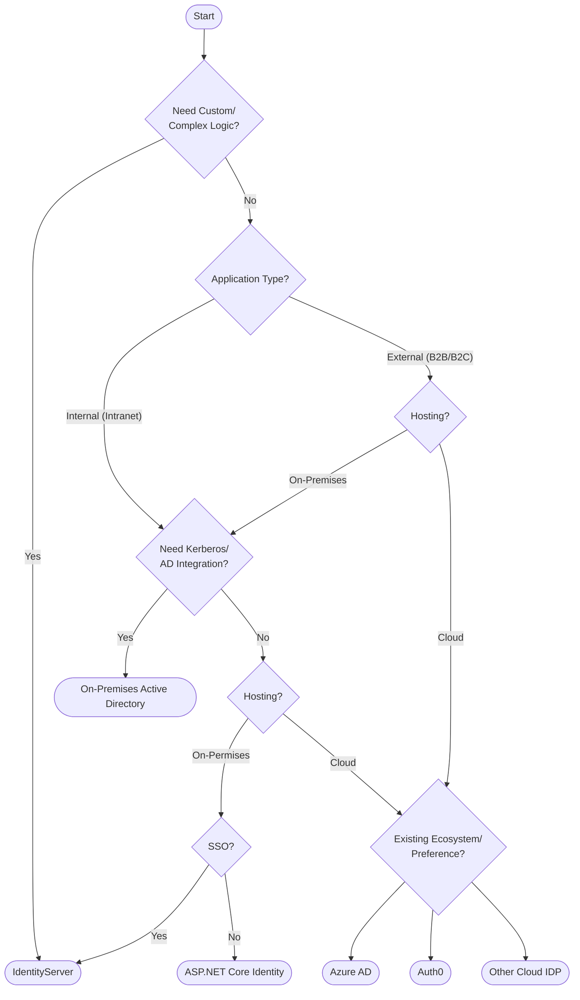

Authentication and authorization are complicated, and it is risky to try and implement them yourself. Use this rule as a guide on choosing the right service or framework for your situation.

::: img-small  
  
:::  

<!--endintro-->

Choosing the right [authentication and authorization](https://www.youtube.com/watch?v=i0d9iTmWIOw) approach for your situation can be tricky. It is a multi-faceted problem with many variables, and what seems like the right choice in one situation may not be in the other.

### Start with the Questions

* **Scope** - Is it an enterprise application for internal users or a consumer application for external use?
* **Scope** - Do you need to share the identity across multiple applications?
* **Volume** - Do you have an estimate for how many users you need to support?
* **Complexity** - do you need to execute arbitrary logic (see below) as part of your authentication process?

Without the answers to these questions, it will be difficult to choose the right option. With the answers to these questions, you can use the tips and flow chart below as a guide to help you choose the right solution.

#### 'Complexity' in authentication

Most applications require some form of authentication, and it's often as simple as providing a secure way for users to log in and ensure that unauthenticated users don't get access to protected resources. However, it's not uncommon to require some logic to be executed as part of the authentication process. Some examples might include:

* Querying an application to get a list of a user's roles
* Calling an API to check a conditional access policy
* Registering a user with an application during sign-up
* Integrating a technology that is not included out of the box (e.g. WebAuthN)
* Non-standard integration with an upstream identity provider

Note that some of the options listed below support or include the features listed above, and these may be configurable directly rather than needing additional code or logic to support. These usually come with additional costs. When you need one of these that is not provided "out-of-the box", you need to build this yourself. Most of the options listed here provide a way to inject custom arbitrary logic into the authentication process, but they have different ways of achieving this and varying limitations.

### Narrow your options

Each project is different, and you will need to consider your individual needs and circumstances when choosing how to implement identity and authentication in your solution. There are countless options available for authentication, but the chart below can provide a guide for some of the major decisions, and help you narrow down to some of the relevant options. Use this to get started and be sure to consider all the other information in this rule before making a decision.

**Figure: Authentication Selection**

Your situation is unique, and every application's requirements are different. These tips can help you identify options to consider for your solution.

#### Additional considerations

In addition to the main points discussed above, the following considerations could also be relevant to your decision.

❗ **Always important:**

* **Scalability:** Depending on the expected user base and request volume, scalability can be a concern. Some solutions might offer better scalability options than others.

* **Cost:** The costs associated with different solutions can vary. It's essential to consider both initial setup costs and ongoing operational costs.

* **Maintenance & Support:** How easy is it to maintain the solution? Is there good community or official support available? This can be crucial for troubleshooting and ensuring the system remains operational.

 

⚠️ **Important - but depends more on your needs:**

* **Regulatory & Compliance Needs:** Depending on the industry, there might be specific regulatory or compliance requirements related to authentication. For example, financial or healthcare industries might have stricter requirements.

* **User Experience:** The ease of use for end-users can be a factor. Some solutions might offer a smoother user experience, fewer login prompts, or better integration with other services.

* **Flexibility & Extensibility:** How easy is it to extend or modify the authentication process in the future? This can be crucial if there's a need to add new features or integrations later on.

* **Security Features:** Beyond MFA, what other security features do the solutions offer? This can include things like anomaly detection, risk-based authentication, or integration with threat intelligence services.

 

While there are too many options to cover them all, this chart will help you narrow your choice to a few key options. Some detail about these options is provided below.

### ASP.NET Core Identity (simple and free)

ASP.NET Core has some built-in identity functionality that allows you to create users and roles, and manage the security of your web applications. It is extremely capable and can be used to support a broad number of scenarios. However, it is intended for use in simple web applications, and while it can be extended to support other clients, you will need to build and wire up a lot of the UI for these scenarios yourself.

[With the new Identity endpoints in .NET 8](https://devblogs.microsoft.com/dotnet/improvements-auth-identity-aspnetcore-8/), you can now support even more scenarios (like using API endpoints to exchange a username and password for an access token).

However, the most important consideration is that this approach is intended for use in a single, standalone application.

**Your identity store will be limited to this one application, so your users will not be able to share this identity across multiple applications.**

::: good
Advantages:
:::

* Free
* Easy to set up and use
* Supports OAuth2/OIDC providers

::: bad
Disadvantages:
:::

* It is recommended by Microsoft that for advanced requirements you don't use this on its own - so need to add one of the below
* Does not scale across multiple applications - so need to add one of the below
* For anything other than an ASP.NET Core Web app (e.g. Angular, React, or mobile), you have to build all UI yourself, such as: sign up, log, password reset, etc.
  * Note: You will need to build this UI yourself anyway if using Identity Endpoints.

**Use this option if...**

* You need to add identity to a simple ASP.NET application

### IdentityServer (full control)

[Identity Server](https://duendesoftware.com/products/identityserver) is an open-source, OIDC compliant solution that is built on top of ASP.NET Core. It has extensive support for a number of authentication and authorization scenarios and supports multiple external identity providers out of the box (meaning it can easily integrate with Microsoft, Google, etc. accounts). IdentityServer extends ASP.NET Core Identity to natively support multiple client types (e.g. web, mobile, machine-to-machine, etc.) and can be used as a single identity across multiple applications.

IdentityServer provides unmatched flexibility and control over your authentication process. While some other options provide ways to execute custom logic as part of a login process, for anything beyond the most basic of scenarios, IdentityServer will be orders of magnitude easier to implement.

By running your own IdentityServer, you can provide and manage your own SSO IDP across multiple applications.

::: good
Advantages:
:::

* Inexpensive
* Allows you to define custom authentication logic (see ['Complexity' in authentication](#complexity-in-authentication) above)
* Supports multiple applications/identity consumers
* Supports multiple clients and client types
* Fully OIDC compliant

::: bad
Disadvantages:
:::

* Learning curve
* Requires additional hosting resources
* Requires additional skill set
* Requires ongoing maintenance
* Annual license fee

**Use this option if...**

* You need to inject custom logic into your authentication flow, or:
* You have compliance requirements that prohibit you from using a cloud IDP

`youtube: https://www.youtube.com/embed/5OUQZAvxZuA?ecver=1`

### OpenIddict (extend to build your own auth)

[OpenIddict](https://github.com/openiddict/openiddict-core) is an open-source framework designed for ASP.NET Core that facilitates the implementation of OpenID Connect (OIDC) servers. Whereas IdentityServer provides a full solution, OpenIddict provides a foundation upon which you can build your own IdentityServer-like product.

Out of the box, it provides support for all of the core OIDC functionality (i.e. granting and validating tokens), but does not provide any UI or user management, or any way to manage clients, resources, scopes etc.

Because of this, it provides even more flexibility than IdentityServer; but this comes at the cost of taking on a significant implementation overhead yourself (it's like saying buying a bunch of car parts provides more flexibility than buying a car).

::: good
Advantages:
:::

* FOSS
* Fully OIDC compliant
* Enables you to build your own identity solution without having to rebuild the fundamentals

::: bad
Disadvantages:
:::

* You have to do nearly everything yourself
* Significant maintenance overhead
* Requires significant security expertise

**Use this option if...**

* You are time rich and money poor, and/or:
* You can commit substantial well-skilled (in security and development) human resources to building and maintaining it, and/or:
* You are intending to build your own authentication product

### Active Directory (for Internal Enterprise Applications)

[Active Directory](https://learn.microsoft.com/en-us/windows-server/identity/ad-ds/get-started/virtual-dc/active-directory-domain-services-overview) has been the de facto enterprise identity store for most of the world for decades. While most organizations are moving to the cloud these days, many still use AD as it provides a lot of additional capability and is integrated with most of their existing enterprise applications. AD supports multiple authentication protocols, including:

* LDAP/LDAPS: simple to use but old tech, requires multiple queries to check permissions, roles not natively supported, and need to be managed by groups.
* Kerberos: Excellent experience for users as it provides a silent and transparent login. But can only be used for on-premises, domain-joined computers.
* ADFS/SAML: Modern application authentication against AD is done via ADFS with SAML. This is often extended through third-party tools such as Okta to support applications that use JWT and claims.
* Proprietary Microsoft: Basic, NTLM, etc.

::: good
Advantages:
:::

* Already in place in most enterprise organizations
* Users do not require an additional identity
* Can make the application compliant with the organization's existing security policies

::: bad
Disadvantages:
:::

* Not suited to external use
* Not natively supported off-premises
* No MFA included

**Use this option if...** 

* Your application, domain controllers, and clients are all on the same network, and:
* You already have AD in place and have a security policy that states that all your users must authenticate against your centralized corporate identity, and/or:
* You want to enable pass-through/silent authentication for your users

### Microsoft Entra ID (previously Azure AD) (for Internal Enterprise Applications)

[Microsoft Entra](https://www.microsoft.com/security/business/microsoft-entra) is Microsoft's cloud-based identity and network/access management platform and provides strong identity features such as MFA and self-service password recovery, as well as access policies and anomoly detection. Being cloud-based, it can authenticate users anywhere in the world (rather than just on-premises on corporate computers).

::: good
Advantages:
:::

* Many organizations already using it
* Extends existing enterprise identity to the cloud (i.e. is supported off-premises)
* Can be used to ensure compliance with existing company security policies
* MFA support included

::: bad
Disadvantages:
:::

* Can be costly for features not in the free tier
* Requires a skilled Azure SysAdmin to manage

**Use this option if...** 

* You want to support internal/enterprise users, and:
* You already have Azure set up, and/or:
* Your users require access from off-site, and/or:
* You **need** to enforce MFA

### Microsoft Entra External Id (previously Azure AD B2C) (simple Auth as a Service)

[Microsoft Entra External ID](https://www.microsoft.com/security/business/identity-access/microsoft-entra-external-id) has replaced AAD B2C. It's part of the Microsoft Entra family and includes all the benefits it provides, as well as enabling consumer-friendly features. These include integration with external identity providers and more flexible/customizable login flows. It is well-tailored to support authentication, and while it can be extended to support additional capabilities, this requires custom development.

::: good
Advantages:
:::

* Inexpensive and generous free tier
* Native support for multiple external auth providers
* MFA support included
* Relatively straightforward to setup
* Ongoing security maintained by Microsoft

::: bad
Disadvantages:
:::

* Very limited flexibility
* Can support roles and other extended functionality, but requires significant development

**Use this option if...** 

* You want to support MFA, and/or:
* Your users are external/consumers, and:
* You anticipate a high volume of users, and/or:
* You only require simple authentication and limited or no authorization

### Auth0 (sophisticated Auth as a Service)

[Auth0](https://auth0.com) is a commercial identity product aimed at developers. It is cloud-hosted and offers out-of-the-box functionality for user signup and login, self-service password recovery, OIDC compliance, external auth integration, and other consumer and user-friendly features. MFA is supported out of the box, and significant sophisticated functionality is available on the paid tiers.

::: good
Advantages:
:::

* Good free tier
* Very easy to set up and use
* MFA support included
* Supports multiple external auth providers
* Significant extensibility

::: bad
Disadvantages:
:::

* Free tier is more limited in volume than competition (e.g. Microsoft Entra External ID)
* Free tier only includes the basic functionality (same as Microsoft Entra External ID)
* Free tier only supports 2 social identity providers

**Use this option if...** 
 
* You want to enforce MFA, and/or:
* Your users are external/consumers, and/or:
* You require authorization or complex authentication

### Okta (for Commercial Enterprise Applications $)

[Okta](https://www.okta.com) is a commercial identity product aimed at enterprises. Many enterprise-centric software products, for example, Salesforce, have Okta connectors. Okta is intended to bridge the gap between enterprise authentication (such as AD) and modern software and SaaS products.

::: good
Advantages:
:::

* Integrates with anything
* Very well supported in the enterprise
* Can simplify integration with AD

::: bad
Disadvantages:
:::

* Expensive
* No free tier
* Not suited to consumer-facing scenarios

**Use this option if...** 

* Your application is for internal/enterprise users, and:
* You already have Okta in place, and/or:
* Your application is a product that you intend to commercialize (Okta is prevalent in the enterprise and having an Okta connector is a good selling point)

### Roll your own - a solution looking for a problem :-) 

It is entirely possible to create a users table and a roles table in your database and create and manage users yourself.

::: good
Advantages:
:::

* Developers feel like they're ninjas for a little while
* Can be a quick and dirty solution to the absolute most basic situation

::: bad
Disadvantages:
:::

* **You have to "reinvent the wheel"**
  * Identity
  * Roles
  * Email verification
  * Login/Signup/Password reset
  * Claims management
* Significant risk
* High maintenance overhead
* Masses of technical debt

**Use this option if...** 

* You want a side project to learn more about how you might roll your own, but of course, you never intend to put it into production :-)

### Sample decision - External Applications

External applications are B2B or B2C applications that are intended for consumption outside of your organization.

#### Example Template to Customer:

::: greybox
 **Scenario:** 
 
Scope - You are building a consumer facing service that will have multiple clients, including a [SPA](https://docs.microsoft.com/en-us/archive/msdn-magazine/2013/november/asp-net-single-page-applications-build-modern-responsive-web-apps-with-asp-net) and a mobile app.     
Social - You want to allow your users to sign up with their social identities (Google, Facebook, Twitter, etc.) but want to allow them to create an account with you if they don't have a social login or don't want to use it.     
All users will have the same level of access once logged in.     
Volume - You anticipate 20,000 active users.     
MFA - You would like to allow users to enable MFA.     

**Your choices:**   

- **Option A** <mark>(Recommended)</mark> - [Microsoft Entra ID](https://www.microsoft.com/security/business/microsoft-entra) provides all of the functionality you need and provides all required functionality in the free tier.  
- **Option B** - [Auth0](https://auth0.com/) - Auth0 will meet most of these requirements, however, your volume of users will exceed the free tier and you don't need the additional functionality of the paid tier.     
- **Option C** - [IdentityServer](https://duendesoftware.com/products/identityserver) - This would work but adds additional management overhead and complexity. You would also need to manage scaling to cope with your volume of users.

:::
::: good
Good example: The chosen solution meets the requirements and is highlighted as per [Do you manage up?](/do-you-manage-up)
:::

### Sample decision - Internal Applications

For internal applications (referred to as "intranet applications" by Microsoft), the requirements might be different to externally facing applications. For example, they are more likely to be hosted on-premises (rare these days), or may need to use Windows Integrated Authentication (also rare these days, but provides a wonderful UX).

#### Example Template to Customer:

::: greybox
**Scenario:**   

Scope - You have an internal enterprise application, which will support approximately 1,000 users.     
You already have Active Directory in place and are syncing with an Azure AD tenant.     
Your users will need to access this application from anywhere.     
MFA - As per your company security policy, you must enforce MFA.     

**Your choices:** 

- **Option A** <mark>(Recommended)</mark> - [Microsoft Entra ID](https://www.microsoft.com/security/business/microsoft-entra) (previously Azure Active Directory) - most of the infrastructure for this is already in place for you, and it already meets all your requirements. We would just need to wire up your application to it.
- **Option B** - [Active Directory](https://learn.microsoft.com/windows-server/identity/ad-ds/get-started/virtual-dc/active-directory-domain-services-overview) - while your users are already in AD, it doesn't give you MFA or access outside your network.
- **Option C** - [Okta](https://www.okta.com/) - this is a sophisticated option but is also expensive and, for this scenario, doesn't provide any advantages over Microsoft Entra ID.

:::

::: good
Good example: The chosen solution meets the requirements without adding unnecessary additional costs  
:::

**Note #1**: All of the following options assume you are building an ASP.NET Core application, although the commercial options listed here provide libraries for most development languages, frameworks, and platforms.

**Note #2**: The information here is relevant as provided, but consider other factors that may impact your decision too. For example, cost may be a factor and saving money may be more important than the added benefits of higher-cost options. Additionally, your situation may not fit neatly into one of the scenarios we have listed and may span multiple scenarios, in which case you may need to pick the option which caters to the broadest set of requirements (avoid 'mix and match').
