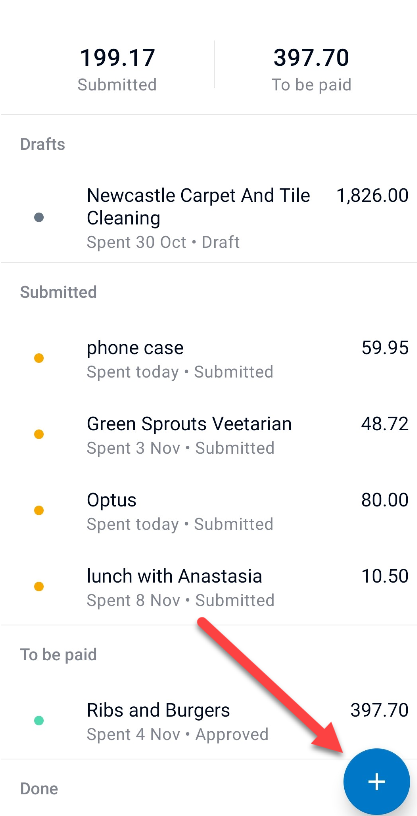
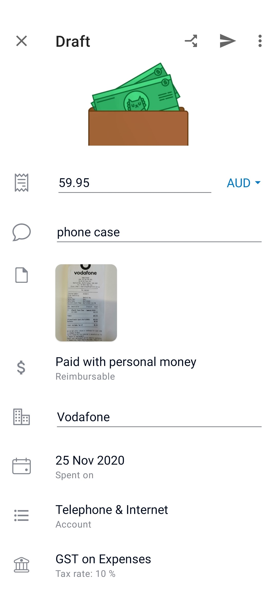
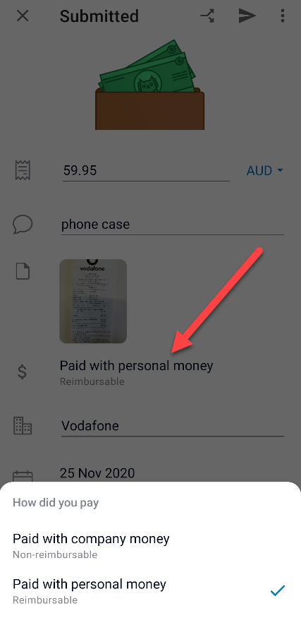
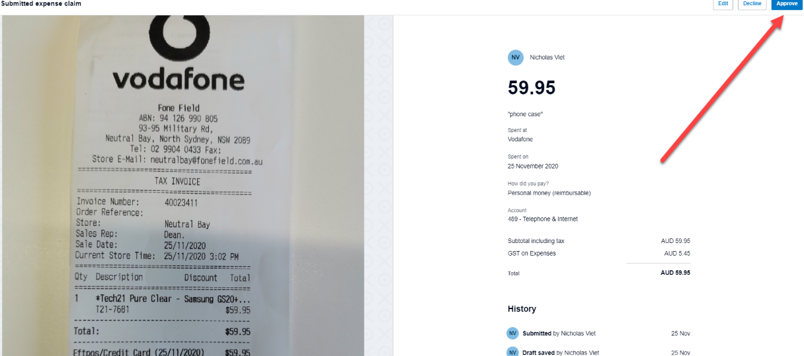
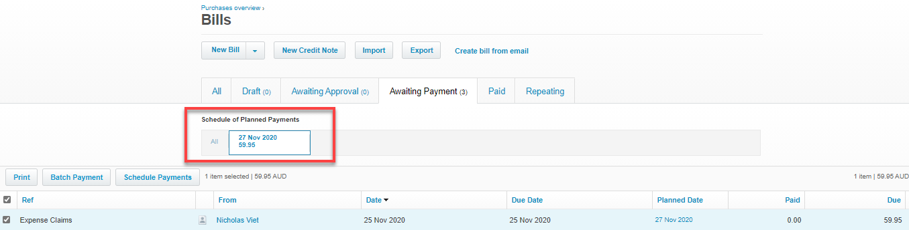

There are several factors to consider when choosing the right expense receipt system, such as:

* Frequency which a reimbursement is made (daily, weekly, monthly etc.)
* Number of employees approved to request expense reimbursements
* Value of expenses allowed to be reimbursed (minor, major or any values)
* Subscription cost of system
* Integration capabilities with Accounting Software

It is recommended to use the Xero Expense app in tandem with the Xero Accounting software because this combination makes it simple to perform reimbursements and has a high level of customer satisfaction.

<!--endintro-->

### Steps to completing an expense reimbursement

#### Employees

1. Open the Xero Expense mobile app and submit a photo of the receipt for reimbursement or filing. For digitally emailed receipts, you can either take a photo of the email and upload it as per usual or you can upload the PDF version of it within the app.

2. Either allow the app to analyse the details automatically or enter the details yourself (if you are strapped for time, you can take a photo and come back to it or hold on to the receipt and attend to it when possible)

3. Confirm whether the expense was paid personally or with company money

 

4. When all details have been checked and are complete, click submit for approval and then wait to be reimbursed. If you are not ready to submit and run out of time, you can save as draft and get back to it by the next day

 

**Note:** if not already done, make sure purchase approval is forwarded to the Accountant or included in the photo submitted.

#### Accountant

1. Review the Xero Expense claims weekly

2. Complete a general check of the receipt details

3. Follow-up on any invoices awaiting approval, or obtain approval where appropriate

4. Schedule for reimbursement to be in line with the upcoming pay

5. Submit the reimbursement along with wage payments

6. Send remittance to employee via Xero 

