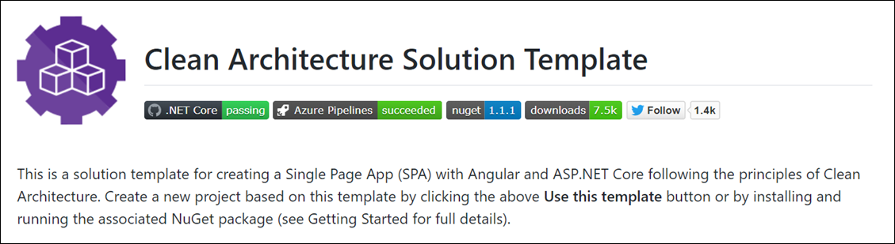

If you're building applications based on .NET Core then the Clean Architecture Solution Template is the best way to get started.

<!--endintro-->

  

The template is designed for creating a Single Page App (SPA) with Angular and ASP.NET Core, but it can easily be used for other .NET Core applications. Create a new project based on this template by visiting https://github.com/jasontaylordev/CleanArchitecture/ and clicking  **Use this template** or by installing the     [.NET Core Project Template](https://www.nuget.org/packages/Clean.Architecture.Solution.Template) package. To do so, follow these steps:

1. Install the latest [.NET Core SDK](https://dotnet.microsoft.com/download)
2. Install the latest [Node.js LTS](https://nodejs.org/en/)
3. Run  **dotnet new --install Clean.Architecture.Solution.Template** to install the project template
4. Create a folder for your solution and cd into it (the template will use it as project name)
5. Run  **dotnet new ca-sln** to create a new project
6. Navigate 
       **to** **src/WebUI** and run  **dotnet run** to launch the project

If you would like to learn more, review the following blog post: [Clean Architecture with .NET Core: Getting Started](https://jasontaylor.dev/clean-architecture-getting-started/).
