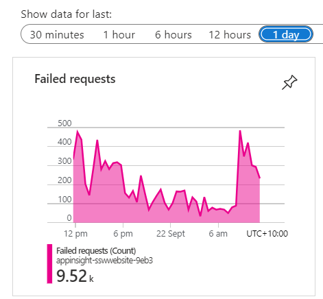

[Application Insights](/why-you-want-to-use-application-insights) provide crucial insights into the health and performance of the application. **Failed Requests** allow the DevOps specialists to identify the specific errors and exceptions occurring in the application. However, keeping Failed Requests clean is crucial to troubleshoot and pinpoint the root causes of the problems efficiently. A cluttered failed requests list filled with irrelevant entries can make it difficult to identify the critical issues that require immediate attention.

<!--endintro-->

`youtube: https://youtu.be/ealr-_vrX3o`

**Video: Do you keep Failed Requests clean? (5 min)**

## Understand your Failed Requests

When cleaning up Failed Requests, it is important to identify the patterns between frequent offenders and categorize them into the following three categories:

1.	Irrelevant – Failed Requests that you expect but cannot do anything about.  
Examples: 404 responses to “/autodiscover.xml”, “/robots933456.txt”.

2.	Probing Attempts – Inbound requests targeting non-existent URLs in your application.
These requests often originate from bots seeking common vulnerabilities. A properly configured Web Application Firewall (WAF) should identify and mitigate such traffic i.e. this should be empty.
Examples: 404 responses to requests for '.php' or 'Wordpress' endpoints not present in your .NET application.

3.	Fixable – Failed Requests that you identify as bugs in your application.  
You can identify these requests by their URL belonging to the real endpoints or files in your application.  
Create PBIs for these bugs, and if you cannot fix any of them yourself, pass them on to the people who can.  
Examples: 404 responses from missing images, 400 responses from API.

::: info
**Note:** Not everything you encounter can be matched to a pattern or fixed straight away.

If that is the case, continue to other requests. As the logs become cleaner, it will get easier to understand the problems with the left-over requests.
:::

::: bad 

:::

::: good 

:::

::: bad 

:::

::: good 

:::

## Clean your Failed Requests

While the Fixable Failed Requests can be dealt with by resolving their underlying causes, the other two categories will continue to clutter your Application Insights.

You can use [Application Dashboard](https://learn.microsoft.com/en-us/azure/azure-monitor/app/overview-dashboard#application-dashboard) and [Azure Workbook](https://learn.microsoft.com/en-us/azure/azure-monitor/visualize/workbooks-overview) to filter out any unwanted failed requests and display only useful information.

**Application Dashboard** is a customizable interface that provides an overview of an application's performance and health. You can access it at the top of the Overview page of your Application Insights. If the Application Dashboard was not yet created, you must have a **Contributor Role** in that Resource Group. A new Application dashboard automatically displays various charts, metrics, and alerts to monitor application behavior.

**Azure Workbooks** is a tool that allows users to create customized dashboards for data visualization and reporting on Azure resources. You can use it to create charts and tables with custom queries in [Kusto Query Language (KQL)](https://learn.microsoft.com/en-us/azure/data-explorer/kusto/query/), and then pin them to your **Application Dashboard**. By using the custom Kusto query, it is possible to filter out any unwanted Failed Requests for your custom chart!

::: info
**Tip:** You do not need to write your query from scratch! 

Go to Application Insights | Failures | View in Logs | Failed request count. 

  

This will provide you with the default query, that you can customize and test in [Azure Logs](https://learn.microsoft.com/en-us/azure/azure-monitor/logs/data-platform-logs), before saving it in Workbooks.

  
:::

When your **Workbook** is ready and the custom query filters out any unwanted failed requests, you just need to pin its chart component to the **Application Dashboard**. If you click on the component from the **Workbook**, that is pinned to the **Application Dashboard**, it will take you inside the workbook. This way, you can use **Workbook** as a drill-down view for your pinned chart.
