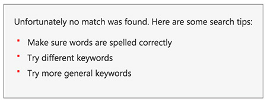
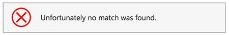
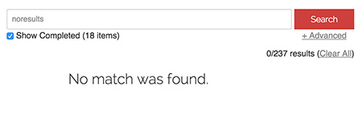
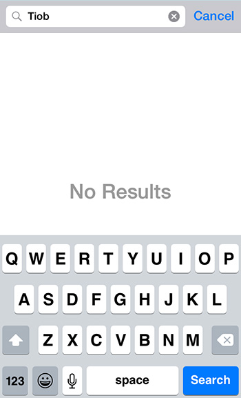

When a user looks at a search result, they expect to see a list of items to look into. If there are no results, don't give them noisy text because it can be taken as a search result. An icon also can be understood as a broken page. Your "no results" page should be clean.​

 <excerpt class='endintro'></excerpt> 
<dl class="badImage"><dt> 
       
   </dt><dd>Figure: Bad example - The list of "suggestions" is just noise and can confuse the user​</dd></dl><dl class="badImage"><dt>
      
   </dt><dd>Figure: Bad example - Having an icon implies that an error happened which is not the case</dd></dl><dl class="goodImage"><dt> 
       
   </dt><dd>Figure: Good example - Plain and clean screen</dd></dl><dl class="goodImage"><dt> 
       
   </dt><dd>Figure: Good example - Plain and clean screen on mobile</dd></dl>

   <b>Note:</b> In case the message you're showing is a "pass" or "fail, it is recommended to use an icon as per <a href=/do-you-use-icons-in-web-pages-to-enforce-the-text-meaning>Do you use icons to enforce the text meaning? </a> 

