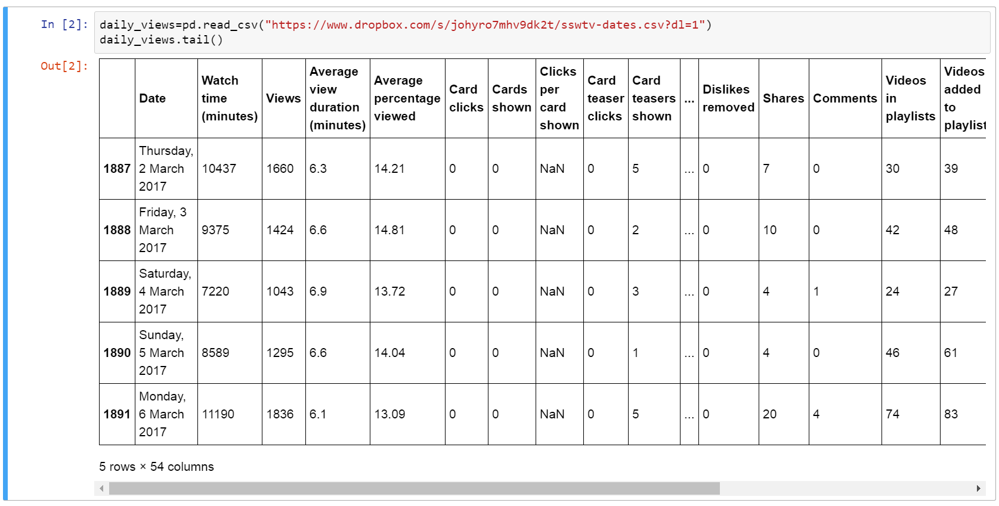
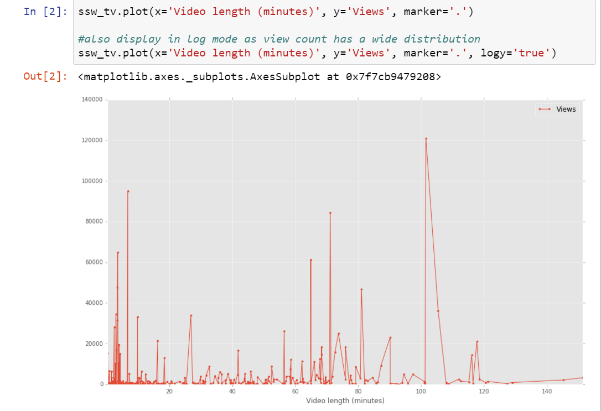
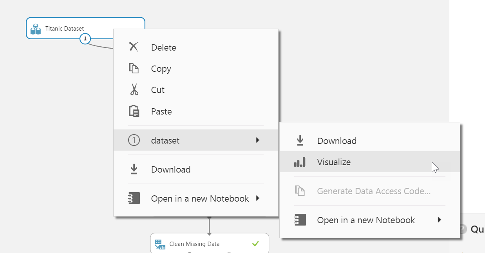
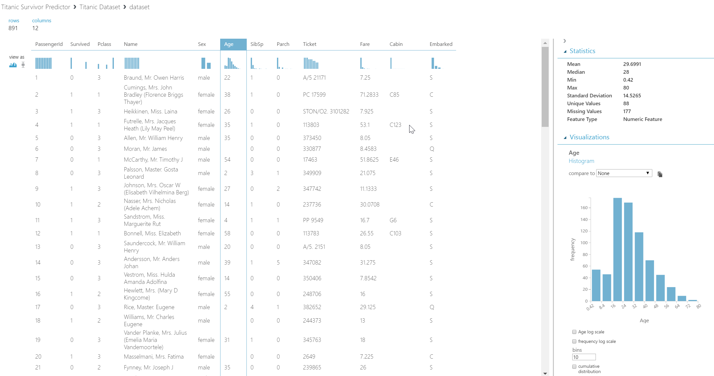
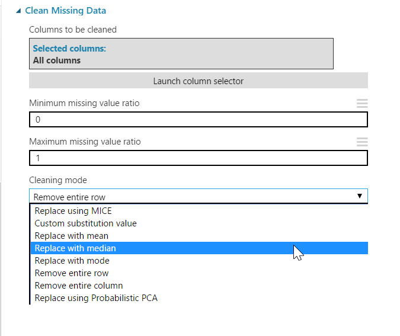

Without proper data cleansing, efforts spent in analysis and modelling are often wasted.  This rule covers the important steps for getting your data in good shape before the hard work begins.

<!--endintro-->

Cleaning data is usually the first step in any data science project, and along with initially procuring the data, this step can take up a considerable amount of time.  This rule will focus on techniques and steps required for data cleansing using Python in Azure Notebooks and using in-built functionality in the Azure Machine Learning Studio.

### 1. Inspect the data
Once the data has been imported, the first step is to visually and graphically inspect the data.  In addition to getting a general understanding of the data, this step aims to uncover data outliers, data with formatting issues and columns where data is missing.

Using Python, data can be inspected in a tabular form by using the head and tail methods of a Pandas dataframe.  These methods will output the first and last five rows of a dataframe (respectively), with an optional parameter allowing the five row default to be modified.  In this step, we are looking for missing data (such as columns with NaN values) and columns where the formatting looks problematic.



Once we have a general sense of the data and have identified columns that contain features that are of interest to the data analysis, the next step is to plot the data to get a feeling for its distribution and to check for any outliers.  The 'plot' method of dataframes supports a rich variety of ways to graphically present data.



For Azure Machine Learning projects, the context menu of a dataset can be used to Visualize the data available for modelling.


Data is displayed in a tabular form, and by selecting a column, key statistics for that column can be inspected.  Two graph types are available for the data - the default histogram view and a boxplot view.  Using this screen, any problems with a dataset can be readily identified.



### 2. Decide on a strategy for dealing with missing data

Missing, incomplete or suspect data can be dealt with in one of four ways:

1. The data can be left as-is if it doesn't impact any analysis or modelling activities.
2. The rows with missing data can be excluded from the analysis.  This is a good option if the percentage of rows with bad data is small or the missing data cannot be inferred or substituted for a sensible value.  This is often the case for non-numeric fields.
3. The data can be set to a default value such as zero for missing numeric fields or an empty string for text columns.
4. The data can be inferred based on other values in the dataset.  This can range from simple calculations like mean or medium to highly advanced formulas like Multivariate Imputation by Chained Equations (MICE).  These techniques will be covered below.

### Data Cleaning and Inference Techniques in Python

To exclude data from a Python dataframe, use a query expression to exclude the rows where the data is missing, and then re-assign the filtered dataframe back to the same variable.  This will permanently remove the rows.  This first code block creates a dataframe with a NaN value in one row:

```py
import datetime
import math
import pandas as pd
import numpy as np

todays_date = datetime.datetime.now().date()
index = pd.date_range(todays_date-datetime.timedelta(10), periods=4, freq='D')
columns = ['A','B', 'C']
df = pd.DataFrame(index=index, columns=columns)
df = df.fillna(0) 

df.set_value('2017-04-16', 'B', math.nan) #set one value in NaN

df.head()
```

Dataframe output:

| | A | B | C |
| --- | --- | --- | --- |
| 2017-04-14 | 0 | 0 | 0 |
| 2017-04-15 | 0 | 0 | 0 |
| 2017-04-16 | 0 | NaN | 0 |
| 2017-04-17 | 0 | 0 | 0 |

Filtering out this row is simple using a square bracket filter expression.  Here we are filtering using the Numpy isfinite method on column B to exclude the problematic row:

```py
df = df.loc[np.isfinite(df['B'])] #filter out the NaN row
df.head()
```

Dataframe output:

| | A | B | C |
| --- | --- | --- | --- |
| 2017-04-14 | 0 | 0 | 0 |
| 2017-04-15 | 0 | 0 | 0 |
| 2017-04-17 | 0 | 0 | 0 |

There is also inbuilt functionality in a dataframe to fill values by interpolation or by taking the mean value of a column.  In the dataframe sample below, it is clear that this is a relationship between row values, with each row showing an increase in the values of each column, making interpolation a valid technique for filling missing data.

This first code sample great a dataframe with a number of rows with incomplete data.

```py
df2 = pd.DataFrame({'Col1': [1, 2, np.nan, 4.8, 6],'Col2': [11, np.nan, np.nan, 16, 28]})
df2
```

| | Col1 | Col2 |
| --- | --- | --- |
| 0 | 1.0 | 11.0 |
| 1 | 2.0 | NaN |
| 2 | NaN | NaN |
| 3 | 4.8 | 16.0 |
| 4 | 6.0 | 28.0 |

The dataframe's inbuilt interpolate method is then used to fill the missing values.  The default behaviour of interpolate is to use a linear interpolation, but a number of more advanced algorithms are also available.  See the [interpolation documentation](http://pandas.pydata.org/pandas-docs/stable/generated/pandas.DataFrame.interpolate.html) for more information.

```py
df2 = df2.interpolate()
df2
```

| | Col1 | Col2 |
| --- | --- | --- |
| 0 | 1.0 | 11.0 |
| 1 | 2.0 | 12.66667 |
| 2 | 3.4 | 14.33333 |
| 3 | 4.8 | 16.0 |
| 4 | 6.0 | 28.0 |

In this code sample, the mean value of a column is used to fill missing data.

```py
df3 = pd.DataFrame({'Col1': [1, 2, np.nan, 4.8, 6],'Col2': [11, np.nan, np.nan, 16, 28]})
df3
```

| | Col1 | Col2 |
| --- | --- | --- |
| 0 | 1.0 | 11.0 |
| 1 | 2.0 | NaN |
| 2 | NaN | NaN |
| 3 | 4.8 | 16.0 |
| 4 | 6.0 | 28.0 |

```py
df3 = df3.fillna(df3.mean())
df3
```

| | Col1 | Col2 |
| --- | --- | --- |
| 0 | 1.0 | 11.0 |
| 1 | 2.0 | 18.33 |
| 2 | 3.45 | 18.33 |
| 3 | 4.8 | 16.0 |
| 4 | 6.0 | 28.0 |

### Data Cleaning and Inference Techniques in Azure Machine Learning


Azure ML has a specific step for cleaning missing data.  The step allows the relevant columns to be selected, the minimum and maximum missing value ratios and the cleaning mode to be used.  The ratios are used to control when cleaning is applied - the default values of 0 and 1 allow cleaning to be applied on all rows, but if the cleaning should only be applied in cases where 20% to 30% of the values are missing, the values would be set to 0.2 for the minimum and 0.3 for the maximum.

In addition to the simple cleaning methods such as removing the row or replacing it with the mean, much more complex methods such as Replace with MICE are available.  MICE stands for Multivariate Imputation using Chained Equations, and is an inference technique that uses the distribution of values across all columns to calculate the best fitting substitution for missing values.  For example, to fill in the missing values in a person's weight column, the information in other columns such as gender and age will be used to predict the best fit for the missing data.  The academic paper [Multiple Imputation by Chained Equations: What is it and how does it work?](https://www.ncbi.nlm.nih.gov/pmc/articles/PMC3074241/) gives a great explanation of the workings of the MICE algorithm.



### Next Steps


Once your data is clean, the next steps are to either move into [in-depth analysis in a Azure Notebook](/use-azure-notebooks-to-learn-your-data)or to use [Azure Machine Learning to look at advanced data prediction and classification](/use-azure-machine-learning-to-make-predictions-from-your-data).
