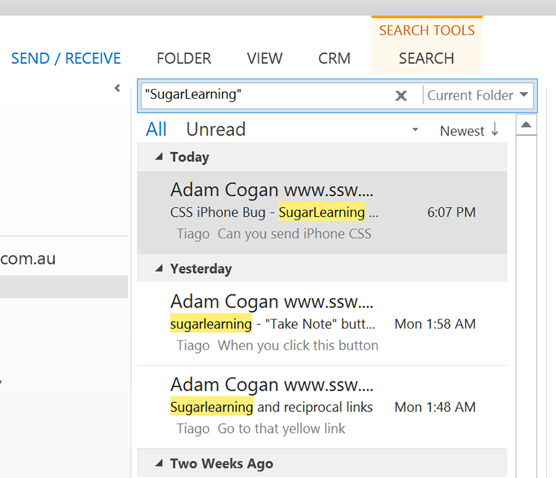

Your inbox should be a [task list](/dones-is-your-inbox-a-task-list-only) and should [be kept clean](/dones-do-you-reply-done-and-delete-the-original-email). When cleaning up their inbox people tend to go from top to bottom. A better way to do it is to search for a specific topic and clean up  **all related emails** . 

<!--endintro-->

::: good  
  
:::
