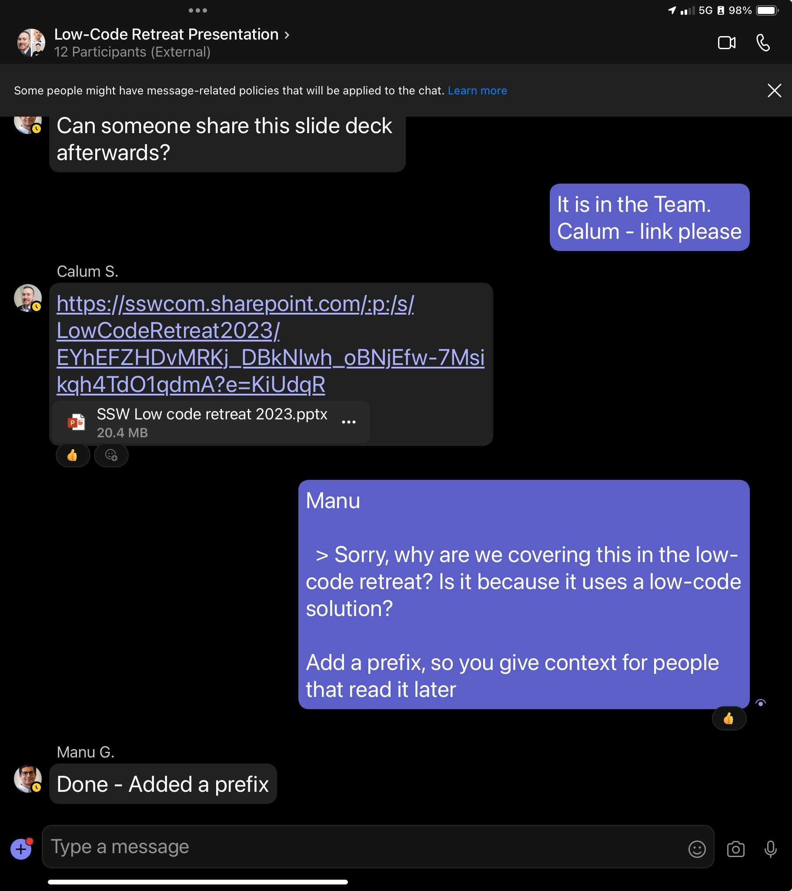

When a task gets finished via email, you should close off the related instant messaging (IM) thread by adding a "Done - see email".

<!--endintro-->

### Why reply "Done - see email"?

* **Clarity** - It tells everybody in the chat that a task is completed. It's a concise signal that minimizes unnecessary back-and-forth.
* **Reducing clutter** - Closing discussions declutters your IM threads, making it easier to manage conversations.
* **Records** - It helps maintain a record of actions taken (although this is already done by the email).

### Use when

* A task related to an email is complete
* You have already sent a [Done email](/dones-do-you-reply-done-and-delete-the-original-email/)
* You want to close the conversation or change topics

::: ok

:::
