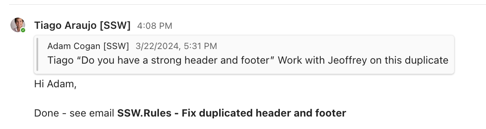

When handling email threads within instant messaging (IM), adding a **"✅ Done - see {{ EMAIL SUBJECT }}"** a clear and concise way to close off a thread.

<!--endintro-->

## Benefits of using this method

* **Clarity and efficiency** - "Done - see email" offers clarity by indicating that an email-related task has been completed. This concise signal minimizes unnecessary back-and-forth, allowing you to focus on more critical matters
* **Reducing IM clutter** - In busy work environments, IM platforms can become crowded. Closing email discussions with "Done - see email" declutters your IM threads, making it easier to manage conversations
* **Record Keeping** - This phrase helps maintain a record of actions taken. It serves as a timestamped reference point for future discussions, aiding in task recall

## Using "Done - see email" wisely

* Employ it when a task related to an email is complete
* Specify action details in the email if necessary
* Summarize key points in complex email threads

Close off a thread by **"✅ Done - see {{ EMAIL SUBJECT }}"** in IM to streamline conversations, reduce overload, and maintain organized records, ultimately improving productivity.

::: info
**Note:** The phrase "see email" can be adapted to various contexts, such as "see PBI/Issue", "see attached document", "refer to the link", or "check the updated project board," depending on the specific details or resources relevant to the conversation's resolution.
:::
