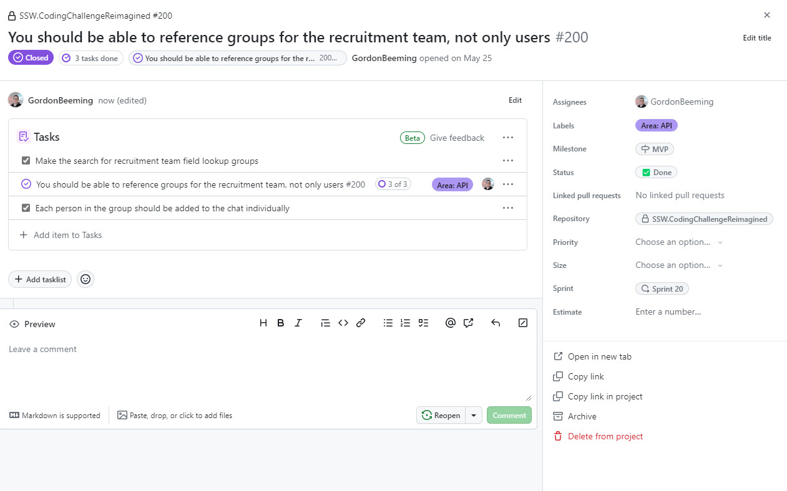
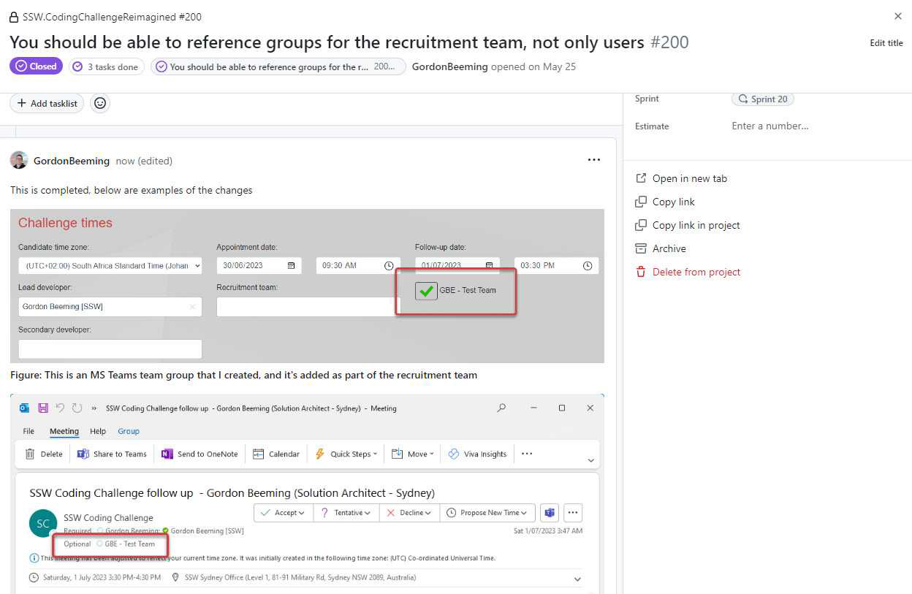
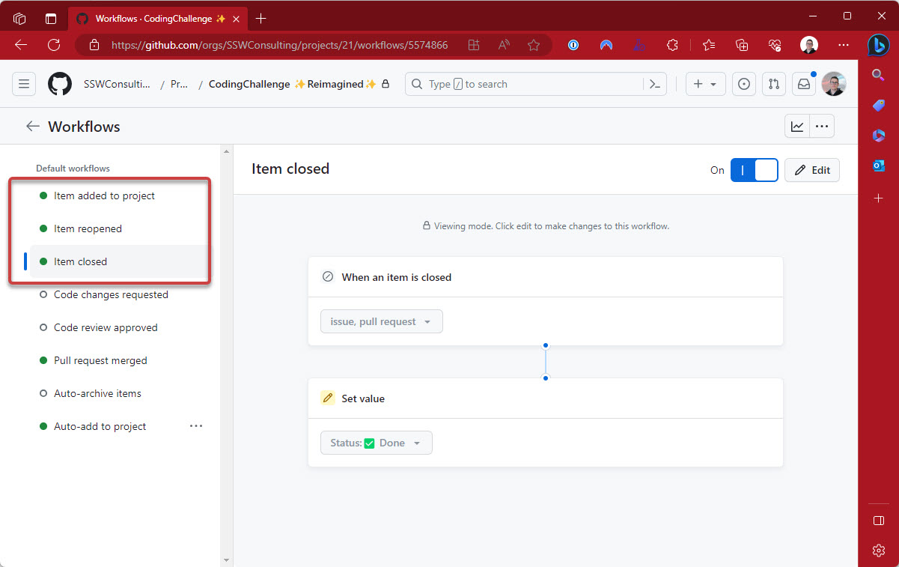

When you close a PBI, you should always add a comment with some context. This allows everyone else to understand why the PBI was closed and what the outcome was. This is especially important when you are closing a PBI as "Won't Fix" or "Duplicate", but also if you have UI changes, a couple of screenshots can go a long way to help the team understand what was done.

<!--endintro-->

When you look at a PBI, you can navigate through the commits or pull requests that were linked to the PBI. This is great for understanding the code changes, but that doesn't easily show you what the outcome was.

::: bad  

:::

::: good  
  
:::

Screenshots are just one of the things that you could add for more context, some other things you could add are:

* [Done Videos](/do-you-send-done-videos)
* Mention if there is relevant documentation that was updated
* Mention any additional context in the pull request that you didn't want to duplicate
* If you'd had a conversation with someone to change the outcome of the PBI, mention ["as per my conversation with..."](/as-per-our-conversation-emails/)
* If you are closing a PBI as "Won't Fix" or "Duplicate", mention the PBI that you are closing it as a duplicate of or why you won't fix it

::: info
**Note:** If you are using GitHub projects you will want to make sure you've checked the workflows for the your project to make sure the team understands the behavior of the work when it's state changes in the project.

You can open the **Hamburger menu | Workflows** to view all the workflows

:::
