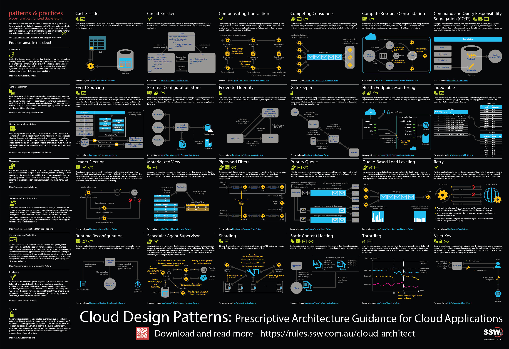

The goal of a modern complex software project is to build software with the best software architecture and great cloud architecture. Software developers should be focusing on good code and good software architecture. Azure and AWS are big beasts and it should be a specialist responsibility.

<!--endintro-->

`youtube: https://www.youtube.com/embed/fkmfZSvW4qM`

Many projects for budget reasons, have the lead developer making cloud choices. This runs the risk of choosing the wrong services and baking in bad architecture. The associated code is hard and expensive to change, and also the monthly bill can be higher than needed.

The focus must be to build solid foundations and a rock-solid API. The reality is even 1 day of a Cloud Architect at the beginning of a project, can save $100K later on.

::: greybox
**2 strong developers** (say Solution Architect and Software Developer)  
No Cloud Architect  
No SpendOps
:::
::: bad
Figure: Bad example of a team for a new project
:::

::: greybox
**2 strong developers** (say Solution Architect and Software Developer)  
 **+ 1 Cloud Architect** (say 1 day per week, or 1 day per fortnight, or even 1 day per month) after choosing the correct services, then looks after the 3 horsemen:

* Load/Performance Testing
* Security choices
* SpendOps

:::
::: good
Figure: Good example of a team for a new project
:::

Problems that can happen without a Cloud Architect:

* Wrong tech chosen e.g. nobody wants to accidentally build and need to throw away
* Wrong DevOps e.g. using plain old ARM templates that are not easy to maintain
* Wrong Data story e.g. defaulting to SQL Server, rather than investigating other data options
* Wrong Compute model e.g. Choosing a fixed price, always-on, slow scaling WebAPI for sites that have unpredictable and large bursts of traffic
* Security e.g. this word should be enough
* Load/Performance e.g. not getting the performance to $ spend ratio right

Finally, at the end of a project, you should go through a "Go-Live Audit". The Cloud Architect should review and sign off that the project is good to go. They mostly check the 3 horsemen (load, security, and cost).

