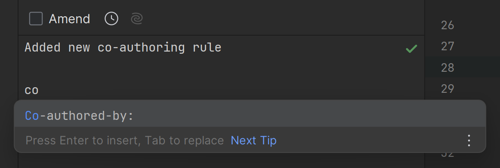

When using [co-creation patterns](/co-creation-patterns) such as pair-programming or mob-programming, you should make sure that all the developers get attribution. When done correctly co-authored commits stand out as a testament to teamwork and shared responsibility, reflecting the collaborative efforts and diverse expertise contributed to each change.

:::img-large

:::

<!--endintro-->

There are several different ways to **create co-authored commits**, depending on the tools you are using.

### Live-Share

If you use [Visual Studio Live Share](https://visualstudio.microsoft.com/services/live-share/) to collaborate, it will co-author the git commits with everyone on the share session

### Visual Studio Code

Visual Studio Code the [Git Mob Extension](https://marketplace.visualstudio.com/items?itemName=RichardKotze.git-mob) can be used to co-author commits.

### Rider

Rider has a great UI that makes creating co-authored commits easy.  It provides intellisense for the co-authored commit trailer, and will suggest the names of the people who have access to the git repository.

:::img-medium

:::

### GitHub Desktop

[GitHub Desktop](https://githubdesktop.vercel.app/) supports co-authored commits out of the box.

:::img-medium

:::

### Git CLI

When writing the commit message, leave 2 blank lines, and give each co-author their own line and Co-authored-by: commit trailer

  ``` bash
  $ git commit -m "Refactor usability tests.
  >
  >
  Co-authored-by: NAME <NAME@EXAMPLE.COM>
  Co-authored-by: ANOTHER-NAME <ANOTHER-NAME@EXAMPLE.COM>"
  ```
