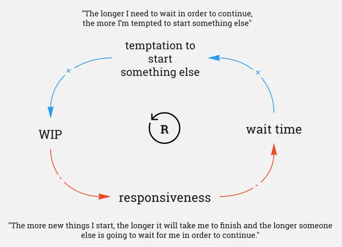
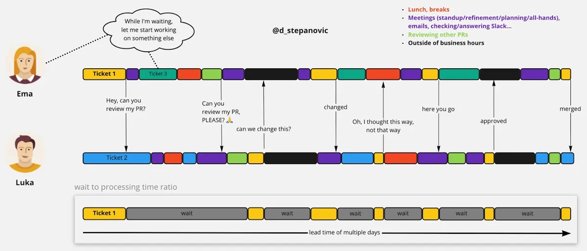

These days Pull Requests are the de facto standard for getting code reviewed. Once a developer has finished their change, they will typically submit a Pull Request and move on to their next task.  This allows for an asynchronous process to take place which may seem like a good idea, but often is not and can also lead to inefficiencies.

<!--endintro-->

`youtube: https://www.youtube.com/watch?v=E4cg5mmvpwo`
**Video: Pair Programming best-practices (11 min)**

## ❌ Problem - Inefficient Code Reviews

Inefficient code reviews can be caused by:

* Requesting feedback too late
* Receiving feedback too slow
* Creating large Pull Requests
* Excessive context switching
* Too much work in progress
* Unclear feedback

::: bad

:::

::: bad

:::

**Source:** [From Async Code Reviews to Co-Creation Patterns](https://www.infoq.com/articles/co-creation-patterns-software-development)

## ✅ How to Make Code Reviews More Efficient

* Author - [Do over the shoulder reviews](/over-the-shoulder)
* Author - Ask for feedback early before the PR, if you are uncertain that you're on the correct path
* Limit work in progress
  * Author - Make sure your Pull Requests are merged, before starting a new task
  * Reviewer - Prioritize Pull Requests before starting a new task
* Author - Create small Pull Requests
  * This requires a smaller block of time to review which makes it easier for the reviewer to find the time
  * Less risk - reduces the chance of an incorrect approach being taken
  * Get quality feedback - small blocks of code are easier to digest
  * Create a [great Pull Request](/write-a-good-pull-request/) to make it easier for the reviewer to understand your changes.
* Reviewer - When reviewing asynchronously
  * Be explicit and suggest the exact code changes where possible (GitHub has a feature for this, see [Incorporating feedback in your Pull Request
](https://docs.github.com/en/pull-requests/collaborating-with-pull-requests/reviewing-changes-in-pull-requests/incorporating-feedback-in-your-pull-request)
  * Call the developer for more complicated changes

## The Ultimate Solution - Co-Creation Patterns

Small Pull Requests have many benefits as outlined above. However, each Pull Request comes with an overhead and making Pull Requests too small can introduce unnecessary waste and negatively affect the throughput of code. In order to not lose throughput with small PRs, reviewers need to react faster. That leads us to synchronous, continuous code reviews and co-creation patterns.

So, with the async way of working, we’re forced to make a trade-off between losing quality (big PRs) and losing throughput (small PRs).

We can avoid this by using co-creation patterns. As a general rule, Pull Requests with less than 20 lines of code, and larger changes with a degree of complexity/risk, make good candidates for co-creation.

> The idea is that you do small PR's but also limit WIP. If you create several small PR's quickly and are waiting for code reviews, you can become blocked very quickly. By co-creating, the small PR's get reviewed & merged instantly which avoids getting blocked and enables you to smash out loads of small PRs! 💪
>
> Daniel Mackay - SSW Solution Architect

### Patterns

Co-creation patterns can take some different forms:

1. **Pair-programming**: Two developers starting, reviewing and finishing a change together
2. **Mob-programming**: Working in a small group, that collectively has all skills required. See <https://www.goretro.ai/post/mob-programming>

For the patterns above, the similarities are that there is a driver and a navigator.

**Driver** - Implements the solution/solves the problem at a granular level. They're the ones on the PC writting the code.
**Navigator(s)**  - Observes and understands the what the driver is implementing at a high-level and inquires where needed to help/direct the driver.

::: info
**Note:** It is not the role of the navigator to micromanage the driver.
:::

These roles should swap often to keep a high level of focus and give everyone an equal chance to participate as a driver and navigator.

When using co-creation patterns, ensure you use [co-authored commits](/co-authored-commits) to give credit to all the developers involved.

### Advantages of co-creation

Co-creation allows us to have both quality and throughput by providing the following advantages:

1. More context when reviewing
2. Higher quality
3. Faster communication
4. Faster course correction
5. Less delay - no waiting
6. Eliminates context switching - working on a change together reduces WIP which further increases throughput
7. Emotions are removed - instead of having an 'author' and 'critic', the code is created together.

### How to get started with Pair Programming

Here's a quick guide to getting started. Just note that these are just guidelines and your team, task and experience will dictate exactly how to achieve your goals and increase your code quality

1. **Select a Collaborative Task:** Pick a Product Backlog Item (PBI) that you and a colleague can jointly work on.
2. **Set Up a Shared Workspace:** Arrange a comfortable space with one computer and two chairs.
3. **Assign Initial Roles:** Decide who will start as the 'driver' (writing the code) and who will be the 'navigator' (reviewing the code).
4. **Maintain Open Communication:** Keep an ongoing dialogue to discuss ideas and approaches.
5. **Regularly Swap Roles:** Switch between the driver and navigator roles periodically to maintain engagement and balance in the partnership.

<!-- 
TODO: Add a PR screenshot of pair programming, show the PR Dan M with Jack R for the big PR for Rules GPT
TODO: Add a PR screenshot of mob programming, we need to demonstrate what the PR would look like for this
 -->
