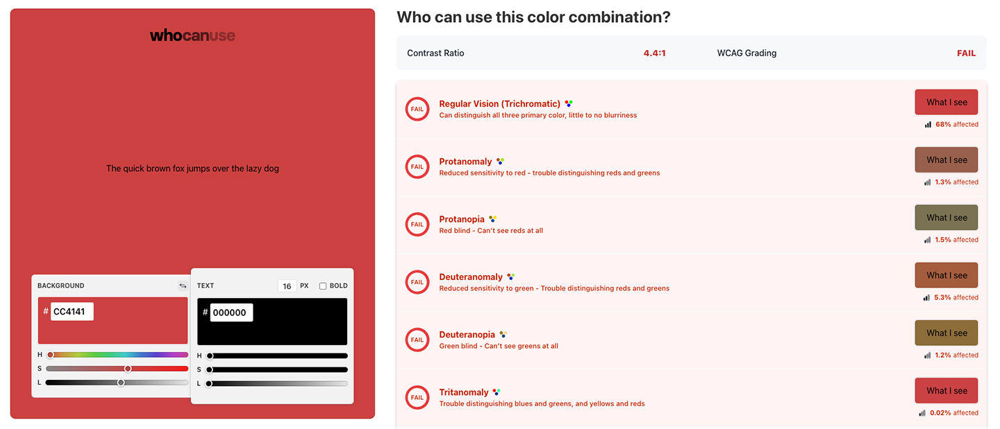
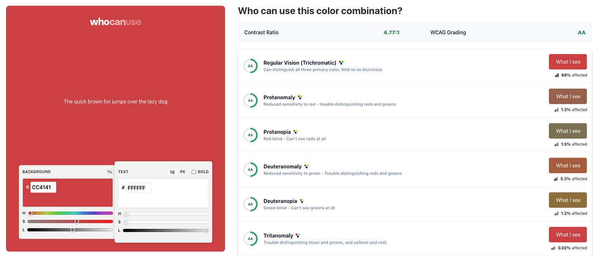

WCAG criterion [1.4.3: Contrast (Level AA)](https://www.w3.org/WAI/WCAG22/Understanding/contrast-minimum.html) recommends text, images of text, and graphics (e.g. icons) have a contrast ratio of at least 4.5:1.
Always check your colors and make your content readable regardless of a user’s ability or circumstance.

<!--endintro-->

## Contrast checkers

Most automated accessibility checkers or browser plugins will check color contrast.
However, try to avoid contrast issues from being flagged altogether!
Use dedicated color checkers to determine acceptable color combinations before implementation.
Always keep in mind that opacity and font weight affect contrast too.

Recommended tools include:

* [WhoCanUse](https://www.whocanuse.com/) – Highly detailed, includes color blindness, sunlight, and low vision checks
* [Adobe Color](https://color.adobe.com/create/color-contrast-analyzer) – A vs AA vs AAA compliance checks, import colors from a file, color blindness tools
* [Coolors](https://coolors.co/contrast-checker) – Simple, easy to use tool for beginners

::: bad  

:::

::: good  

:::

## Notable exceptions

There are few acceptable exceptions to the contrast criteria, including:

* Incidental text (disabled, inactive, hidden, or purely decorative)
* Logos (Text included in a logo or brand name)
* Large-scale text (which only needs to meet a contrast ratio of 3:1)

Even in these circumstances it’s good practice to make your text as readable as possible.
