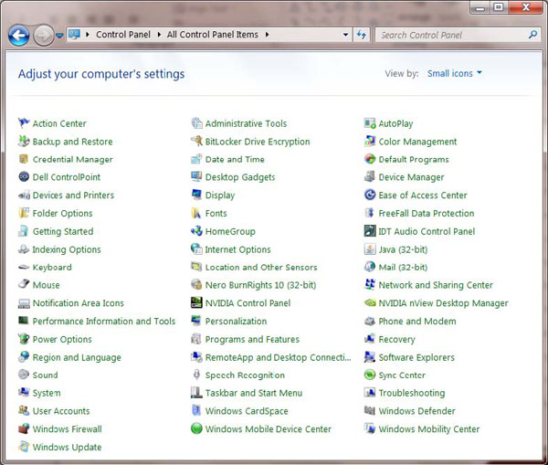
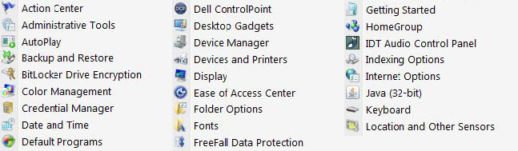

The search direction of a list should be obvious. When it comes to a multicolumn list, you should always head down instead of across for legibility.

<!--endintro-->
<dl class="badImage">&lt;dt&gt;&lt;/dt&gt;
<dd>Figure: Bad example - The list columns go across instead of down</dd></dl><dl class="goodImage">&lt;dt&gt;&lt;/dt&gt;
<dd>Figure: Good example - The list is going down</dd></dl>
