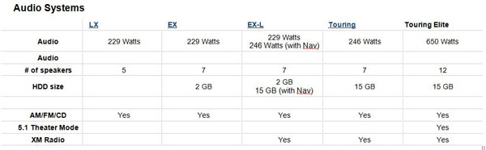

<dl class="badImage">&lt;dt&gt;&lt;/dt&gt;
<dd>Figure: Bad example - Hard to read these columns</dd></dl>
<!--endintro-->
<dl class="goodImage">&lt;dt&gt;&lt;/dt&gt;
<dd>Figure: Good example - The whole table has been re-written and is now easier to understand</dd></dl>
