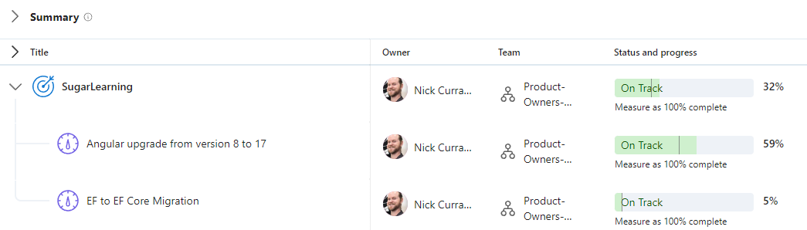

As a Product Owner, you are representing the product's Stakeholders on the Scrum Team. You will be a representative of the Product to other people in your business, such as your manager or director. You will often be asked the question "How is your Product going?"

::: info
**Tip**: Keep Stakeholders informed of progress and enthused about your project using monthly meetings.
:::

To prepare for meetings and maximise the chances of success for your project, ensure you have answers to the following questions:

1. **Value - What features have been delivered recently?** Celebrate your successes and demonstrate how your Product is adding value to Stakeholders.

    Examples could include:
    - A new login screen with better accessibility for visually impaired users
    - Support for a new business process
    - A shortened user registration process

2. **Development - How has the Roadmap progressed?** A PBI is a small chunk of work conducted to progress a larger aim. Explain how have the completion of these PBIs contributed to achieving the aim of the Product Roadmap? 

    For example:
    - Adding Mandarin translations for an Angular component as part of an internationalization feature
    - Adding payment processing as part of a new subscription feature

    ::: info
    **Tip**: Software such as [Microsoft Viva](https://www.microsoft.com/en-au/microsoft-viva/goals) can be used to graphically demonstrate progress.
    :::

    

3. **Development - What delays or blockers have been encountered while writing the software?** [Software development is painful and costly](https://www.ssw.com.au/rules/do-you-manage-clients-expectations/). Explain the difficulties that the project has encountered, and detail your plan to overcome those difficulties.

    For example:
    - The upgrade between Angular versions was delayed as the team's Frontend expert has been sick. A new expert has been brought in to complete the work.
    - The new customer registration process was taking longer than expected to implement. The intention is to make it simpler with fewer screens.

4. **Operations - How do the Product's metrics compare historically?** If you have responsibility for the operation of your Product, you need to be tracking metrics such as the number of users accessing the system or how many hours they are spending on your site. Provide graphs to demonstrate trends.

    For example, have a graph demonstrating how the user count has changed over the course of the last 2 calendar years.

    

5. **Operations - What issues have been seen in Production?** [All errors should be logged](https://www.ssw.com.au/rules/do-you-log-every-error/), so you should be able to list any significant errors that Stakeholders and users have experienced and the plan to prevent those errors in future. You should also be actively monitoring for performance issues. All such issues should have plans for investigation or rectification.

    For example:
    - The frontend has experienced an increase in exceptions when adding new users to the system. This was been tracked to a bug in how data is being serialized from the backend, and was fixed last Sprint.
    - Since upgrading the database server version, a significance increase of 2 seconds in server response time has been seen. System Administrators are investigating.

6. **Planning - What decisions have been made regarding the project?** As Product Owner, you will be approving changes to the behaviour of the product and many of these changes will be in development. Explain the decisions that you've made and their rationale. Try to catch misalignments in Stakeholder views before your decisions are coded.

    For example:
    - I have modified the permissions model for the website to allow contributing users access to unpublished articles, as they often request input from each other.
    - I approved the mock-ups for the website redesign, as they were cleaner and easier to understand than the current website pages.

7. **Planning - How should the Roadmap be changed to remain relevant?** Circumstances and priorities change - work with your Stakeholders to ensure that your Product fulfils their requirements while making efficient use of development resources. In extreme cases, the Product Goal itself may need to be revised.

    For example:
    - Users have had significant difficulty writing new articles, as the editing control does not make it easy to link to other articles. Therefore, work should be prioritized to improve how inter-article links are created.
    - There has been a significant increase in users, so work needs to be prioritized to improve the throughput of transactions.

8. **Resources - do you have everything you need to complete the updated Product Roadmap?** Ensure that you have agreements for funding, personnel or services, or everyone will be unhappy when the Roadmap is inevitably not delivered.

    For example:
    - To implement the article search functionality, approval is required for an increase in funding to cover the Azure Search Service instance.
    - To implement the Artificial Intelligence co-writing feature, approval is required to apply for and pay for the Azure OpenAI Service.

::: info
**Tip**: Record your Sprint meetings so that you have a record of the decisions and main points of the meeting. It also helps to demonstrate how the Scrum Team is working together to advance the Product.
:::

## Recording the conversation

To aid preparation and communication of decisions, use the email template below. Note that this template uses "epics", which are collections of PBIs. If your project doesn't use Epics, then substitute epics with the collection mechanism that you use.

::: email-template
|     |     |
| --- | --- |
| To: | {{ STAKEHOLDERS }}
| CC: | {{ PROJECT GROUP EMAIL }} |
| Subject: | {{ PRODUCT NAME }} - {{ DATE }} - Roadmap Review and Revision |
::: email-content

### Hi Everyone,

Here is a summary of recent progress made for {{ PROJECT NAME }}.

|                        |                                           |
| ---------------------- | ----------------------------------------- |
| Sprints                | {{ START SPRINT }} - {{ CURRENT SPRINT }} |
| Dates                  | {{ START DATE }} - {{ END DATE }}         |
| Production Environment | {{ LINK TO PRODUCTION ENVIRONMENT }}      |
| Test Environment       | {{ LINK TO TEST ENVIRONMENT }}            |
| Development Dashboard  | {{ LINK TO DEVELOPMENT DASHBOARD }}       |
| ---------------------- | ----------------------------------------- |

## Value - Delivered Features

- {{ FEATURE 1 }} - {{ BRIEF NOTE }}
- {{ FEATURE 2 }} - {{ BRIEF NOTE }}

## Development - Roadmap Progress

- {{ EPIC 1 }}
    - Progressed from {{ START PERCENTAGE BY EFFORT }} to {{ END PERCENTAGE BY EFFORT }}
    - ETA {{ ETA }}
- {{ EPIC 2 }}
    - Progressed from {{ START PERCENTAGE BY EFFORT }} to {{ END PERCENTAGE BY EFFORT }}
    - ETA {{ ETA }}

## Development - Delays and Blockers

- {{ EPIC 1 }}
    - {{ BLOCKAGE 1 }} - {{ PLAN TO WORK AROUND BLOCKAGE }}
- {{ EPIC 2 }}
    - {{ BLOCKAGE 2 }} - {{ PLAN TO WORK AROUND BLOCKAGE }}

## Operations - Product Metrics

{{ GRAPH OF USER STATISTICS }}

{{ GRAPH OF UNAVAILABILITY }}

## Operations - Issues Seen in Production

- {{ OUTAGE 1 }} - {{ 1 PARAGRAPH DESCRIPTION OF FAILURE, INCLUDING TIMES THAT THE FAILURE OCCURED }}
- {{ PERFORMANCE ISSUE }} - {{ 1 PARAGRAPH DESCRIPTION OF ISSUE }}

## Planning - Decisions

- {{ APPROVED MOCKUP 1 }} - {{ BRIEF DESCRIPTION }}
- {{ APPROVED BEHAVIOUR CHANGE 1 }} - {{ BRIEF DESCRIPTION }}

## Planning - Roadmap Changes

- Add {{ EPIC }}
- Deprioritize {{ EPIC }}

## Resources - Requests

- Approved for {{ SERVICE EXPENSE }}

```
