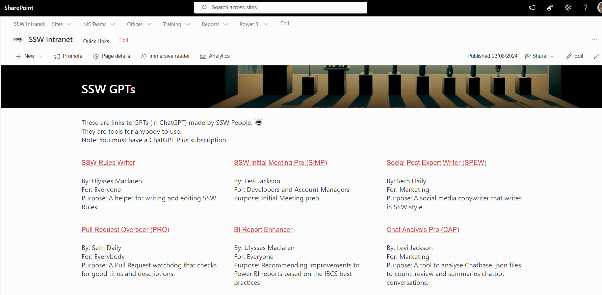

As more organizations adopt GPTs and AI tools to streamline work processes, one common issue arises: employees are often unaware of what tools exist or how to access them. This leads to underutilization of powerful resources, and even duplication of efforts when different teams independently create similar tools.  

<!--endintro-->

A directory of AI tools (e.g. GPTs) ensures that everyone in the company knows what tools others have been using available.

### Benefits

* **Awareness**: You want all your employees to know about the tools
* **Adoption**: Employees are more likely to use tools that are easy to find
* **Avoid Duplication**: You don't want 2 people to work on the same tool without knowing - you want visibility into what already exists.

### Best Practices

1. Location -  Make it easy to find by putting the directory front and center on your intranet homepage
2. Descriptions - Include a brief explanation of the purpose and use case
3. Support - Include the author so users know where to seek for help or clarification.

::: good

:::
