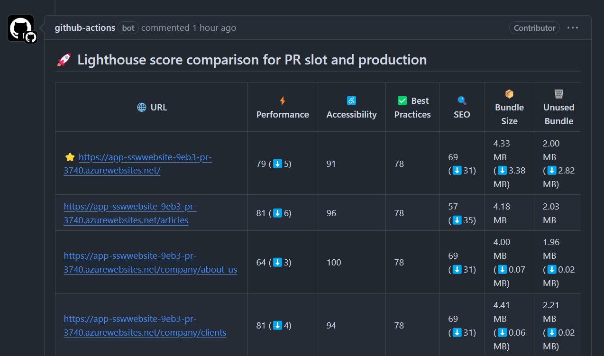

Before merging any Pull Request (PR) that might affect your application's behavior or performance, you should run comparison tests between the production environment and the PR deployment slot to identify potential issues.

<!--endintro-->

## Why compare PR performance with Production?

It is essential to compare PR performance against the production environment. This ensures that new changes do not introduce performance drops that can negatively impact user experience, SEO rankings, or best practices.

Modern web applications are dynamic, with frequent updates to code, styles, and assets. Even minor changes can lead to increased load times, larger bundle sizes, or degraded accessibility. By integrating automated performance checks into your CI/CD pipeline, you can catch issues early and maintain high application quality.

## How to compare PR performance with Production?

One of the best ways to measure performance is by using **Lighthouse**, a widely used tool for analyzing key web performance metrics such as:

- Performance (e.g., page load speed, rendering time)
- Accessibility (ensuring usability for all users)
- Best Practices (security, coding standards)
- SEO (ensuring search engines can properly index the site)
- Bundle Size & Unused Code (optimizing assets for faster loading)

## Automating Lighthouse Comparison in PRs

You can integrate Lighthouse into your GitHub Actions workflow using [Lighthouse CI Action](https://github.com/treosh/lighthouse-ci-action). This enables automated comparison of the PR deployment with the current Production site. A summary comment can be added to the PR, showing key performance differences.

::: good  

:::

By following this approach, teams can ensure that new code changes do not negatively impact performance. The comparison table allows developers to quickly identify performance drops and take action before merging, leading to a more consistent and reliable user experience.
