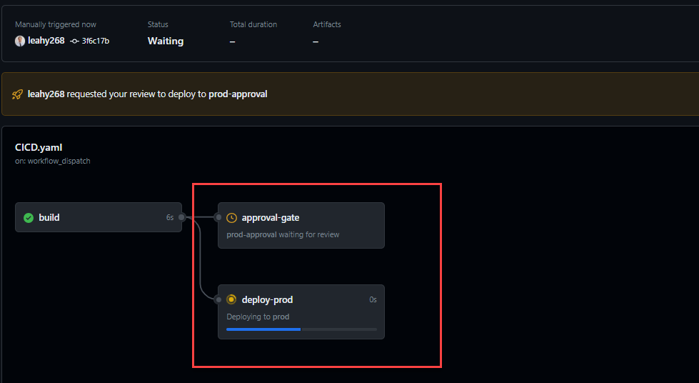

When making significant changes to your pipeline, it's crucial to test them in a separate repository first. This approach ensures that the main repository remains unaffected by potential errors or disruptions during the testing phase. Most importantly, it guarantees that unintended deployments, especially to production, are avoided.

<!--endintro-->

Examining a mistake directly in the GitHub YAML file can be error-prone and might not provide a clear understanding of the issue.

::: bad

:::

To safely test a pipeline, particularly one that deploys to production, it's imperative to use a separate repository. In this environment, actual deployment steps can be substituted with placeholders, such as `echo "deploying"`, ensuring a thorough test without real-world consequences. If such a test were conducted on the main repository, it could inadvertently trigger a deployment to production.

By executing the pipeline and examining its graphical representation, errors or inefficiencies become more apparent. This visual insight aids in swiftly pinpointing and comprehending any issues.

::: good

:::