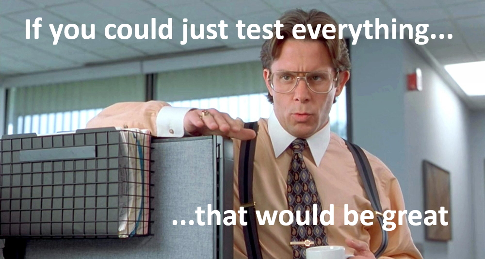
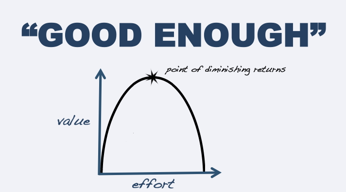

Without a good understanding of testing and its limitations, it's easy for clients and customers to believe that we "test everything" - but there's a problem with this belief:

**Complete (or 100% or exhaustive) testing is impossible.**

<!--endintro-->

### Why is it impossible?

Complete testing is impossible for several reasons:

* We can’t test **all** the inputs to the program.
* We can’t test **all** the combinations of inputs to the program.
* We can’t test **all** the paths through the program.
* We can’t test for **all** of the other potential failures, such as those caused by:

  * User interface design
    errors and other usability problems
  * Incomplete requirements analyses
  * Malfunctioning hardware
  * Humans making mistakes when using the software
  * Hardware/software compatibility issues
  * Timing issues, etc.

For non-trivial programs, complete testing is impossible because the population of possible tests is infinite. So, you can’t have complete coverage - no matter how many tests you run, only partial coverage can be achieved.

### What about "100% coverage"?

You might think that achieving "100% coverage" is the same as complete testing, especially if you listen to the claims of coverage tool vendors. 100% of what, though?

Some people might say that "100% coverage" could refer to lines of code, or branches within the code or the conditions associated with the branches. Saying "100% of the lines (or branches, or conditions) in the program were executed" doesn’t tell us anything about whether those lines were good or bad, useful or useless.

"100% code coverage" doesn’t tell us anything about what the programmers intended, what the user desired or what the tester observed. It says nothing about the tester's engagement with the testing; whether the tester was asleep or awake. It ignores how the tester recognized - or failed to recognize - bugs and other problems that were encountered during the testing.

Code coverage is usually described in terms of the code that we’ve written. Yet every program we write interacts with some platform that might include third-party libraries, browsers, plug-ins, operating systems, file systems, firmware, etc. Our code might interact with our own libraries that we haven’t instrumented this time. So "code coverage" always refers to **some** code in the system, but not **all** the code in the system.

Testing is an open investigation. 100% coverage of a particular factor may be possible, but that requires a model so constrained that we leave out practically everything else that might be important. Relying on "100% coverage" means that we will miss significant classes of bugs.

### We can’t do complete testing, so what can we do?

Since complete testing is impossible, choosing the tests to perform is essentially a sampling problem. Adopting approaches such as risk-based testing are important in making good sampling decisions.

The focus should be on doing "good enough testing". You can say you’re done when you have a testing story adequately covering the risks agreed with your stakeholders and you can make the case that additional tests will probably not significantly change your story. Depending on the situation, this might require months of testing, sometimes only hours.

Watch the <a href="https://vimeo.com/451827063">BBST&reg; Foundations Lecture 5 - The Impossibility of Complete Testing</a> by Dr Cem Kaner on <a href="https://vimeo.com">Vimeo</a>.   

Read [The Impossibility of Complete Testing](https://bbst.courses/wp-content/uploads/2022/08/Kaner_impossibility.pdf) by Dr Cem Kaner.