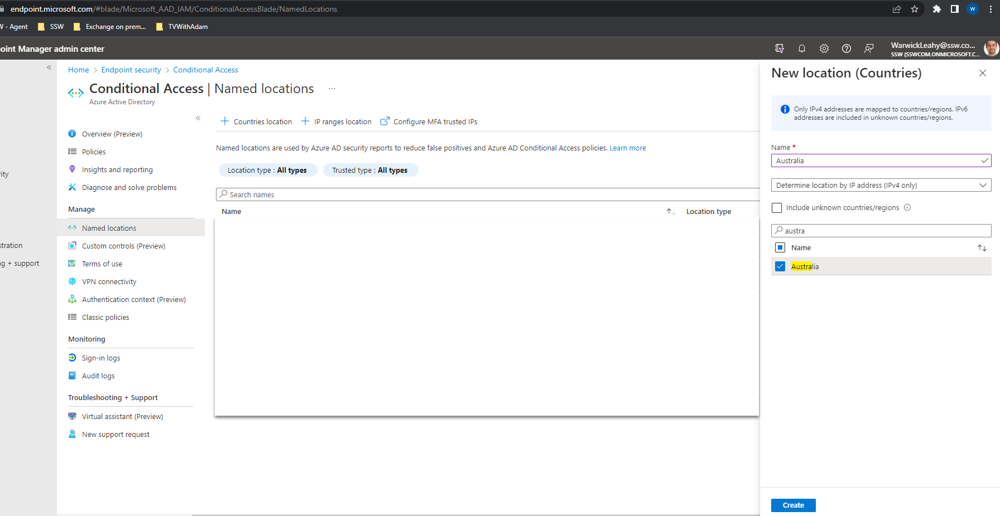
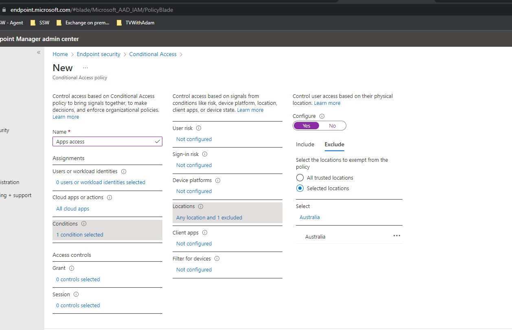

Did you know that you can stop your users from logging into any of your Azure or Office365 resources based on the location they are in? What about the types of devices that they can connect from or only allowing connections that use MFA? These things are all possible to restrict.

This seriously limits the attack surface and also helps to stop compromised devices and accounts from being used.

<!--endintro-->

::: bad

:::

### Configure locations

First you need to add any locations that you require for your office.

1. Go to [https://endpoint.microsoft.com](https://endpoint.microsoft.com) | Endpoint security | Conditional Access | Named locations
2. Click + Countries location and add required countries

   

3. Add as many as you require for your users to access

   

### Configure policies

Now configure some policies to implement these rules

1. Go to [https://endpoint.microsoft.com](https://endpoint.microsoft.com) | Endpoint security | Conditional Access | Policies
2. Select New policy | Create new policy

   

3. Give it a name then select Cloud apps or actions | Select All cloud apps

   

4. Select Conditions | Locations
   Then set configure to yes and Include to "Any location"

   

5. On Exclude choose Selected locations and then exclude your workers countries (i.e. Australia)

   **Note:** This must be done this way as the user must not meet a block access rule ever if they are to login.

6. Now select block access for this rule

   

### Create a grant rule

7. Similarly create a rule that applies to all cloud apps as above
8. This will be exactly the same as the above rule except that you should not have conditions and should Grant access with MFA

   

9. You will notice that each of these rules have a 'Report only' mode or enforce. You should leave it on report mode and monitor the audit logs.

   **Check for any failures and only apply the rules to a small subset of your users before changing them to 'On'. This is very important as you can stop everyone including yourself from logging in.**

   

### International Travel Notice - Exclude travelling users and let them keep their access to work resources while on holidays or overseas

When a user goes overseas and needs access to the company resources, you should temporarily exclude them from the Block Access policy.

Traveling users should inform and request access prior to their departure. A good way to do this is via Microsoft Forms:

::: good

:::

Otherwise they will get this message:

#### In-Flight Wi-Fi
When using in-flight Wi-Fi, even on domestic flights, you may occasionally lose access to Microsoft services. This occurs because most in-flight Wi-Fi providers rely on satellite networks that span multiple countries. As a result, your network traffic may appear to originate from a foreign location, which can trigger blocks depending on how your conditional access policies are configured.

To prevent this, we recommend connecting through your corporate VPN so that your connection is identified as coming from a trusted location.

::: bad

:::
