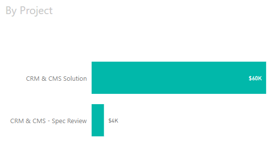

A client will often ask for a proposal or ballpark for the project. It is very difficult to give them the price for a large project without first conducting a Specification Review. 

The Spec Review is a process that will demonstrate to the client whether you have the commercial sense to understand their **business** and have the technical and management capacity to complete the project.

It is paid work conducted after the initial meeting to determine the overall scope, feasibility, and ballpark costs of the project (i.e. $50k or $500k).  

E.g. Mr. Northwind learns that the idea he presented at the initial meeting will cost approximately $80K and he has to determine if that is feasible to his business or if he will trim the functionality to better manage the cost.

<!--endintro-->

::: greybox
*"From this initial meeting, the ballpark is 6 months and $200k+GST"*
:::
::: bad
Bad example - Big scary figure
:::

::: greybox
*"From this initial meeting, we will first need to conduct a Specification Review.
This first step is $8k - a 2-day Specification Review"*
:::
::: good
Good example - Work in small chunks of work with details about what you will do
:::

### Spec Review length

The Specification Review is conducted by two experienced developers at the client premises in close consultation with the client. The time allocated for a Spec Review is generally 1 - 5 days depending on initial expectations of the project. The rule of thumb is 1 - 2 days of Spec Review per estimated month of project time.

The purpose is to understand the whole project but, if the project is greater than six months, focus primarily on the first six months.

### Talk about business requirements

* **Conduct workshops:** Conduct workshops with different groups of users (e.g. management, back office, customer service) to build the "Product Backlog" which the business wants. This ensures that all users get their say. Some "nice-to-haves" might actually be quite easy to implement. Product Backlog Items can then be prioritized and fleshed out.
* **Review documentation:** Reviewing any documentation the client may already have. Remember clients are mostly looking to software consultants to assist them in solving business problems.
* **Keep technology discussions short:** Unless they have a specific business purpose, detailed discussions about technology with the client are unlikely to be useful. For example, most clients won't be interested in a discussion about whether to use .NET or Angular at this stage.
* **Identify an MVP:** Most client can't afford everything they want, so make sure you're keeping track of the minimum we can do to deliver value.

### Do something valuable

Most software consulting experts will be able to provide a small improvement to the current system 'on the fly' during the Spec Review. This may be something as simple as adding an index to a table and thereby increasing the performance of a web page.

### Use 'Corridor Conversations'

Corridor Conversations are a great way to set the clients expectations so you don't suprise them with a big number at the end of the Spec Review. 
See [Do you have Corridor Conversations?](/corridor-conversations)

### Estimates expressed in round numbers (or exact numbers for fixed price)

Remember, no politician challenging for leadership ever calls a vote before he or she knows the numbers; you too will avoid presenting a solution at a meeting if you aren't convinced the client is already agreeable. 

Through the course of the Spec Review, the client will be aware that each month for senior software consultants is generally tens of thousands of dollars. Squabbling over $500 here or there in the ballpark phase is a level of detail neither side can be confident of. Clients need to be realistic about what they get for their money.

::: greybox
*"Now that we've spent a few days speccing this out, we believe the solution will take approximately 6 months which is $204,000+GST."*
:::
::: bad
Bad example - Far too firm a price when you don't know any of the detail
:::

::: greybox
*"Now that we've spent a few days speccing this out, our projection is the project will take a minimum of 6 months (around $200,000+GST) to complete but this may change depending on what is finally agreed in the Specification. The price will vary depending on resources used and the time that elapses over testing."*
:::
::: good
Good example - Leaves some wriggle room at these initial phases
:::

Read [When do you use approximate values for project costs?](/spec-give-customers-a-ballpark)

### Technology options

At this stage, you want to consider the most relevant technologies. For example, SSW will likely pursue recent Microsoft technologies. Some clients might want to do their own research or need some time to think about their options before agreeing to newer technologies.

### Proposal

You should follow [Rules to Better Proposals](/rules-to-better-proposals) when documenting a Specification Review.

### Test Please

The consultant must run a [Test Please](/conduct-a-test-please-internally-and-then-with-the-client) by another developer and your Account Manager before anything is formally presented to the client.

The main things the Account Manager will be looking for will be:

* Have you already had corridor conversations with the client so they're already expecting the ballpark estimate?
* Are the estimates realistic and still incorporating any relevant buffers? e.g. Project Management, bug fixing, etc.

::: greybox
**Tip:** Record a video of your PowerPoint presentation. Ideally a 5-minute summary is very handy for people that did not attend the meeting to decide if they should go ahead. Also if new developers join the project later on, this video is a nice handover. 

You can record your presentation using [Recording Studio in PowerPoint](https://aka.ms/recordingstudio) or [Camtasia's PowerPoint Add-In Toolbar](https://www.techsmith.com/learn/tutorials/camtasia/ppt-addin-toolbar/).
:::

### Example Schedule for a 1-day Specification Review

You want to have all the required work for a Spec Review done within the allocated time, so it’s important you leave time to implement the required changes after you present and before you email the final version.

* **9 am:** Meet with the client and discuss requirements
* **11 am:** Start work on the backlog and the PowerPoint (.PPTX) or Word Doc (.DOCX)
* **3 pm:** Present to the client and gather feedback for changes
* **5 pm:** Implement changes
* **6 pm:** Send “As per our conversation” with Word or PowerPoint attachment

In a 2 or 3-day Spec Review, you should assume you’ll need more time to implement changes, so move the presentation time earlier to 2 pm.

### Timesheets

Always track timesheets against a separate Spec Review project. 

It makes project cost reporting difficult later if you don't, since the cost we're looking for is always the "post-Spec Review cost" that clients can compare to the estimate you gave in your Spec Review.

