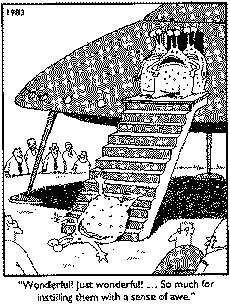

<b>​Test, test, test!</b> Testing is the most critical part of any project. Before the delivery of any release the application must pass an internal "test please". Clients quickly become disillusioned if you have delivered a bug-riddled application. 
 <excerpt class='endintro'></excerpt> 
<dl class="image" style="padding:15px;width:230px;float:right;"><dt> 
       
   </dt><dd>Figure: Do you want users to have good first impressions? </dd></dl>
There are a number of different types of tests that you can perform:
<ul><li>
      <b>Unit Testing:</b>
      
It validates the smallest testable parts of an application. Unit tests do not cover the UI layer. There is no industry standard 3rd party unit test tool but at SSW we use NUnit and Visual Studio Team Test.
</li><li>
      <b>White Box Testing:</b>
      
White box testing or structural testing is done knowing the internal code implementation and targeting specific aspects: for example security risks or a potential performance bottle neck. By looking at the implementation it helps to identify areas where the system could be flawed. Because the tests are designed to match the code, if the implementation changes, the tests will need to change. 
</li><li>
      <b>Black Box Testing:</b>
      
Black box testing or functional testing, unlike the White box testing, doesn't rely on the knowledge of the internal code structure. It relies on the software specifications and requirements. The tests use valid and invalid inputs and check that the output is correct.
</li><li>
      <b>Integration Testing:</b>
      
Integration testing is performed when all the software components are put together. This testing should be done after each individual software component has passed unit testing. This type of testing highlights interface problems or misunderstanding of the software specifications where unit tests local to each component actually passed. Automated integration testing is essential and often run overnight due to the time it takes.
</li><li>
      <b>User Acceptance Testing (UAT):</b>
      
UAT or Beta Testing occurs at the end of the software development cycle (this could be at the end of a Scrum Sprint where the software is potentially shippable). As its name points out the end users will test the software and check it meets their acceptance criteria.
</li><li>
      <b>Security testing:</b>
      
Security testing is done to check that a system protects data and maintains confidentiality as intended. The concepts covered by Security testing can include: network mapping, vulnerability scanning, password cracking, confidentiality, integrity, authentication, authorization, availability, non-repudiation and virus scanning.
</li><li>
      <b>Performance testing:</b>
      
Performance Testing is used to determine the responsiveness, the effectiveness of a system under a given workload. Qualitative attributes such as reliability, scalability and interoperability may also be evaluated. Performance testing is often done along with stress testing.
</li><li>
      <b>Smoke testing:</b>
      
Smoke testing is done to ensure the system doesn't have any critical bugs that would make other types of testing unnecessary. This type of testing is generally performed on a new or fixed software. A Smoke test should cover essential parts of the application so it is said to be shallow and broad.
</li></ul>

      <b>Does the "Test Please" principle apply to more than code?</b>
Yes! A "Test Please", aka peer review highlights unseen errors, proposes new ideas for consideration or confirms the existing work as the best solution. A peer review can also effect cultural change amongst your development team as developers become more open to critiques of their work and comfortable with a 'continuous learning' environment. A "Test Please" will also be applied to:
   <ul><li>Brief proposals</li><li>Release plans</li><li>Estimates​ </li><li>Anything else being sent to a client</li><li>Anything else being sent to an employee of a sensitive nature</li><li>Anything being sent for public consumption - such as newsletters, print documents and or advertisements.</li></ul>
Always put "test please" in the email body so readers know they are expected to react quickly. 

<h3 class="ssw15-rteElement-H3">Lead Developer responsibilities</h3>
Please cc the client in all your "Test Please" emails including internal ones.
<ol><li>At the end of a release, prepare a "Test Please" email.  Create the email by copying the text from the sample 
      <a href="/_layouts/15/FIXUPREDIRECT.ASPX?WebId=3dfc0e07-e23a-4cbb-aac2-e778b71166a2&TermSetId=07da3ddf-0924-4cd2-a6d4-a4809ae20160&TermId=ec137193-bbcb-43a7-bc9a-4d337395aa22">Test Please Template </a> .</li><li>Get two testers to test your app - if it's a web app make sure one uses IE and the other Firefox.</li><li>Specify exactly what is required to be tested by adding some bullet points at the top and highlighting in 
      yellow, so it stands out from the template text. e.g.
      <ul><li>
            Run Timesheet report </li><li>
            Check changing a rate </li></ul></li><li>Make sure the testers send one bug/suggestion per email.</li><li>
      <a href="/_layouts/15/FIXUPREDIRECT.ASPX?WebId=3dfc0e07-e23a-4cbb-aac2-e778b71166a2&TermSetId=07da3ddf-0924-4cd2-a6d4-a4809ae20160&TermId=7d5d1090-be17-4128-985b-b7e419812179">Triage</a> emails as they come in for completion in this release, or a later release.</li><li>Don't change testers in the middle of a release. It is just sneaky to get a test failed from a tester and then try again by using another tester :-)</li><li>Make sure that the testers know which build they are testing. The developers may be 3 builds ahead of the testers, but they need to complete a test run on an individual build to make sure that bugs are fixed and that there are no regressions.
      
Note: Having a good branching strategy makes this easy as you can run an Internal and External "Test Please" on your DEV branch before allowing the code to be committed to Main/Trunk. This protects your Main/Trunk branch from contamination by code that does not work.
</li><li>Randomly have the manager do a "Test Please" as well. He gives a pass or fail on the job the testers did.</li><li>When you receive a "Test Please Succeeded" from both testers (and never before) prepare a "Test Please" for the client. (If you are requested to issue a non-tested release to a client state "Has not passed internal testing" in the email.)</li></ol><h3 class="ssw15-rteElement-H3">Tester responsibilities</h3><ol><li>Confirm you are a tester - If the developer did not name you, make sure he corrects himself and resends the 'test please' email.</li><li>Ensure you are working on the Standard Operating Environment specific to the client and using the right browser for web apps.</li><li>Use 
      <a href="http://www.ssw.com.au/ssw/Standards/DeveloperGeneral/networkTools.aspx#TeamViewer"> Team Viewer</a> if you aren't available locally.</li><li>Test within the hour - testing is typically urgent.</li><li>Know what to test.</li><li>Be thorough - anything from a crash-to-code bug to a minor UI change should be reported .(one email at a time)</li><li>Classify issues accordingly to "this release" or "next release" following the 
      <a href="http://www.ssw.com.au/ssw/Standards/Support/BugReportOrEnhancement.aspx">report bug/enhancement</a> standard. Any crash to code bugs must be fixed in the current release.</li><li>"Reply to all" for each bug or feature. (to ensure no issue is reported twice)</li><li>Specify how you replicated the bug through clear instructions and screenshots.</li><li> When finished reply to the 'test please' email with "Test Please Succeeded (as no Critical bugs)" or "Test please failed (as per critical bugs reported)". 
       </li></ol>

      <strong>Subject:</strong> RE: Test Please - \\Public Folders\All Public Folders\SSWeXtremeEmailsDatabase\SSWCodeAuditor\Release09

Gary,

​<strong>Test please failed</strong>

(as per 
      critical bugs reported in other emails)   

<dd class="ssw15-rteElement-FigureNormal">Figure: This is how to reply failed to a "test please" email </dd>

   
<iframe width="750" height="422" src="https://www.youtube.com/embed/whxbTtkH5GU" frameborder="0"></iframe> 

<b>​Note: </b>If the test to be performed is quick and the tester is available on the spot, consider using a "<a href="/_layouts/15/FIXUPREDIRECT.ASPX?WebId=3dfc0e07-e23a-4cbb-aac2-e778b71166a2&TermSetId=07da3ddf-0924-4cd2-a6d4-a4809ae20160&TermId=b44ce620-2be6-4c95-ba62-cb6b36bfbb4a">checked by</a>" style instead to save some time.​ 

