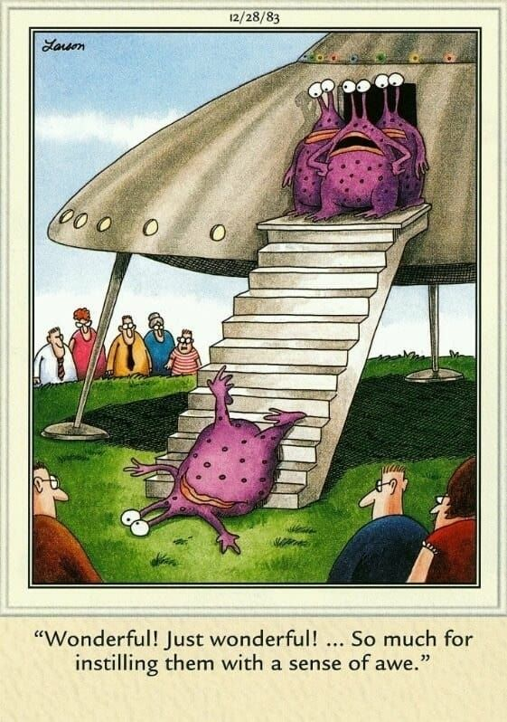

**Test, test, test!** Testing is the most critical part of any project. You should get another set of eyes to check the work (aka conduct a "Test Please") before delivering the feature. This ensures the client has a great experience when receiving a quality application with confidence that it performs as expected.

<!--endintro-->

`youtube: https://www.youtube.com/embed/4MJGuRL1HP8`
**Video: Test Test Test! | William Liebenberg | SSW Rules (2 min)**

 

::: greybox  
**Does the "Test Please" principle apply to more than code?**

Yes! You almost always want a "Test Please". We usually want a second pair of eyes to catch unseen errors! This isn't necessary for small changes e.g. spelling mistakes.  
:::

If you are writing code, your Pull Request (PR) is your "Test Please".  
Tip #1: You should do an [over the shoulder PR review](/over-the-shoulder)
Tip #2: Embrace Proactive Testing – If you anticipate potential feedback or issues with your code, ensure it is tested by a team member in the development environment after merging.

If you are writing an email, a [Checked By](/checked-by-xxx) is your "Test Please".

If you are doing anything else (e.g. updating a Word doc or preparing a PowerPoint presentation), you should still get a 2nd set of eyes to check the work and document it somewhere.

::: email-template  
|          |     |
| -------- | --- |
| To:      | Gary |
| Subject: | RE: Test Please - \\Public Folders\All Public Folders\SSWeXtremeEmailsDatabase\SSWCodeAuditor\Release09 |  
::: email-content  

### Hi Gary,

**Test failed**
(as per critical bugs reported in other emails) 
`youtube: https://www.youtube.com/embed/whxbTtkH5GU` 

**Video: Test Failed! (10 sec)**
::: 
:::
::: good  
Figure: Good Example - Sometimes it's good to soften the blow with some humour when you have to fail a "test please" email 
:::

**Note:** If the test to be performed is quick and the tester is available on the spot, consider using a "[checked by](/do-you-know-when-to-do-use-checked-by-xxx)" style instead to save some time.
