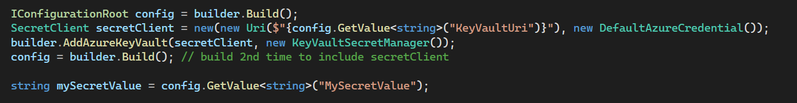

We all know that we should [Store Secrets Securely](/store-your-secrets-securely) using Key Vault, but did you know that rather than have developers having to deal with a combination of Key Vault and Configuration, you can abstract Key Vault out of your application code and leave developers to only have to deal with Configuration?

<!--endintro-->

::: bad

:::

A feature of Azure AppService is the ability to [use secrets from Key Vault as Configuration values](https://learn.microsoft.com/en-us/azure/app-service/app-service-key-vault-references). This allows you to setup a link between your AppService and a Key Vault and have Configuration values point to a Key Vault Entry.

So now rather than developers having to think about if a value is a secret or configurations, it's always configuration. It just might have its value stored securely in Key Vault.

::: good

:::
