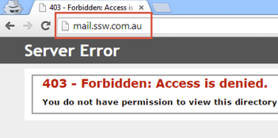

Users like to access Outlook Web App (OWA) using well known address e.g. mail.ssw.com.au. Since OWA is running under a different URL they will face a 403 error. In such case it is good to redirect them to HTTPS address where OWA is actually running, e.g.

<!--endintro-->

From http://mail.ssw.com.au

To https://mail.ssw.com.au/owa
::: bad

:::

The following Microsoft articles explains how to configure redirection to HTTPS for OWA:

* [HTTP to HTTPS redirects on IIS 7.x and higher](http://blogs.msdn.com/b/kaushal/archive/2013/05/23/http-to-https-redirects-on-iis-7-x-and-higher.aspx)
* [How to configure Exchange to redirect OWA HTTP requests to HTTPS requests in IIS 7](http://support.microsoft.com/kb/975341)
