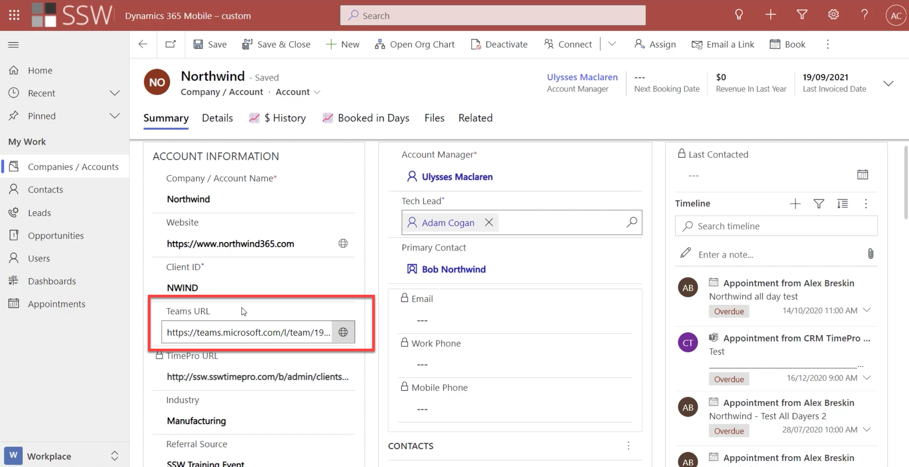
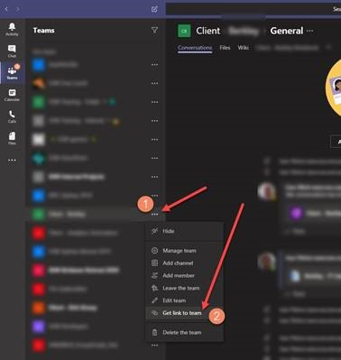
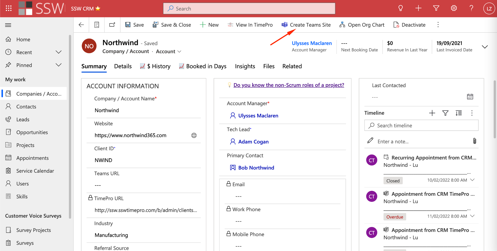
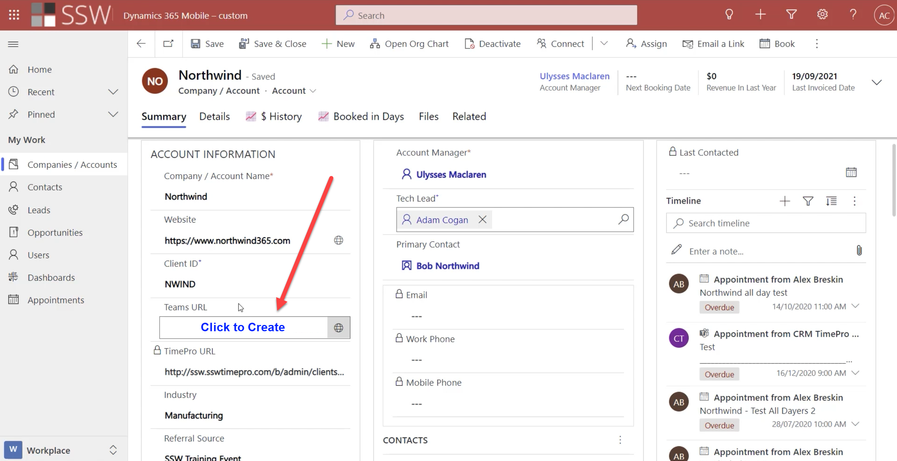

At your company, you never want to have a person asking "Where is that file?"
The answer should be "The answer is Teams, the question is irrelevant".

Microsoft Teams is a great solution for organizing client files and conversations. Create a new Team for each of your clients, and if you have multiple projects for one client, use Channels to keep them separate. There's no need to create a new Team just for a new project.

Once you have this set up, it is likely that you want to have a link between your Teams instances and the associated CRM record.

<!--endintro-->

`youtube: https://www.youtube.com/embed/3nkO8BxG8Sc`

In the video, Adam Cogan describes how they connect Dynamics 365 and Teams with an extra field. They change the Account table to add a custom column 'Teams-URL'.

:::greybox
**Note:** Each client should have its own Team. You might have two associated clients - e.g. Northwind Australia and Northwind USA - but if they are separate legal entities and have separate accounts in CRM, they should have separate Teams.
:::

### Level 1: Manual method

To get that URL, simply click the ellipsis next to your Team name and click "Get link to Team".

### Level 2: Automatic (Basic)

Add a button to the Ribbon to provision a new team and link to it.

##### How to add the button to the Dynamics Ribbon?

* [Customize the command bar - Power Apps | Microsoft Docs](https://docs.microsoft.com/en-us/powerapps/maker/model-driven-apps/use-command-designer) (new approach - customizing command bar using the command designers)

or

* [Ribbon Workbench](https://www.develop1.net/public/rwb/ribbonworkbench.aspx) (old approach -  using the ribbon workbench)

### Level 3: Automatic (Advanced - best UX)

Using a PCF control you can add a button directly into the form that can do everything for you.

Click on this section on your CRM Dynamics to have a Team created:

**Note #1:** Alternatively, this process can even be automated using Azure functions and Graph API to provision a new Team every time a new client is created in CRM. This has the disadvantage that every single Account would get a Team...and that could create a real mess of unused Teams.

**Note #2:** The Team's name can get out of sync if the Dynamics client name is changed, therefore you need one extra flow that is called when the client name is changed to keep them in sync.

See [how the PCF can make UI's shine](/customize-dynamics-user-experience).
