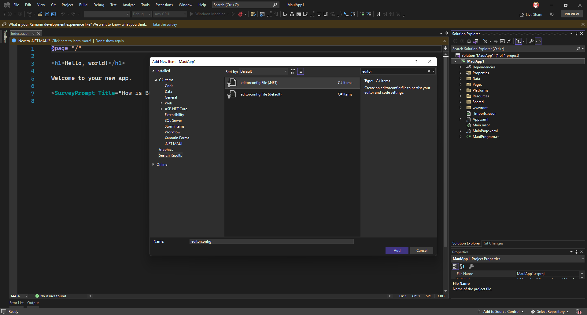
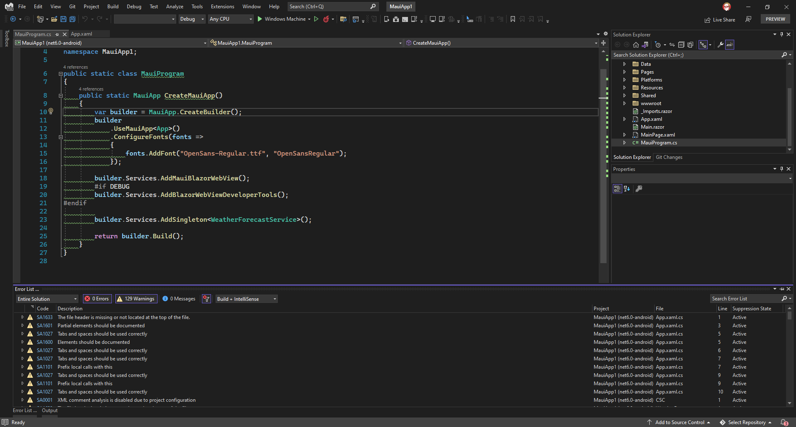

It's important that the code in a project is kept consistent. This is hard to do when you have developers working in different environments. 

Using a *.editorconfig* file is the best way to manage this.

<!--endintro-->

See the [EditorConfig file specification](https://spec.editorconfig.org)

Most IDEs will automatically find and use a *.editorconfig* file to format code.

See [Keep your code clean, automatically!](https://devblogs.microsoft.com/visualstudio/visual-studio-17-1-preview-2-is-now-available/#keep-your-code-clean-automatically).

::: good

:::

::: bad

:::

## Creating **.editorconfig** files

**In VS 2022**
1. Open the Add New Item dialog (Ctrl+Shift+A)
2. Search for "EditorConfig"
3. Select a config file depending on your project

**Manually**
1. Create a new file called *.editorconfig* at the root of your project
2. Add styling rules based on your needs

## Ensuring compliance
To ensure your team is following this standard, you can add it to your [Definition of Done](/definition-of-done).

Additionally, you can have a PR check that enforces *.editorconfig* rules, but its always better to do this locally.

Learn more on:
- [EditorConfig website](https://editorconfig.org)
