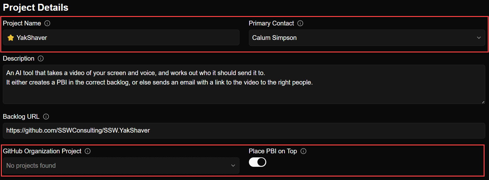

Field width gives users a visual cue about the type and length of data expected. Avoid making a field excessively wide when the value will only be a few characters, and likewise avoid squeezing long values into fields that are too narrow. Size fields proportionally and keep them consistent so the UI sets the right expectation.

<!--endintro-->

::: bad  
  
:::

::: good  
  
:::
