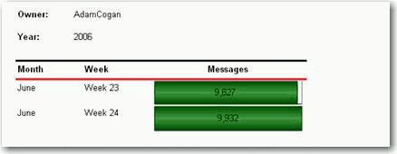
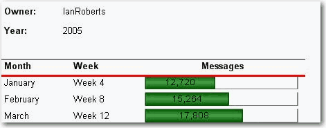
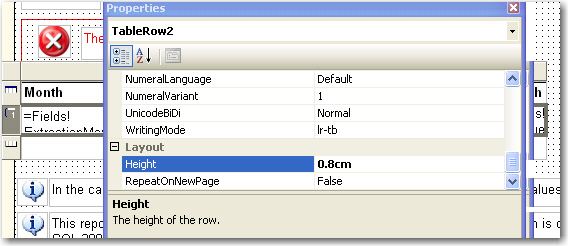
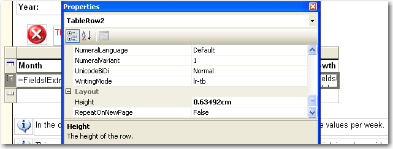

Same height of table row across all reports gives users consistent and professional impression.
<!--endintro-->

We use the default height of table row (0.63492cm) as a standard to make sure all tables in our reports have consistent row height.

This rule also applies to height of Textbox in all reports.

::: bad  
  
:::

::: good  

:::

::: bad  
  
:::

::: good  

:::

::: greybox
We have a program called [SSW Code Auditor](https://codeauditor.com) to check for this rule.
:::
