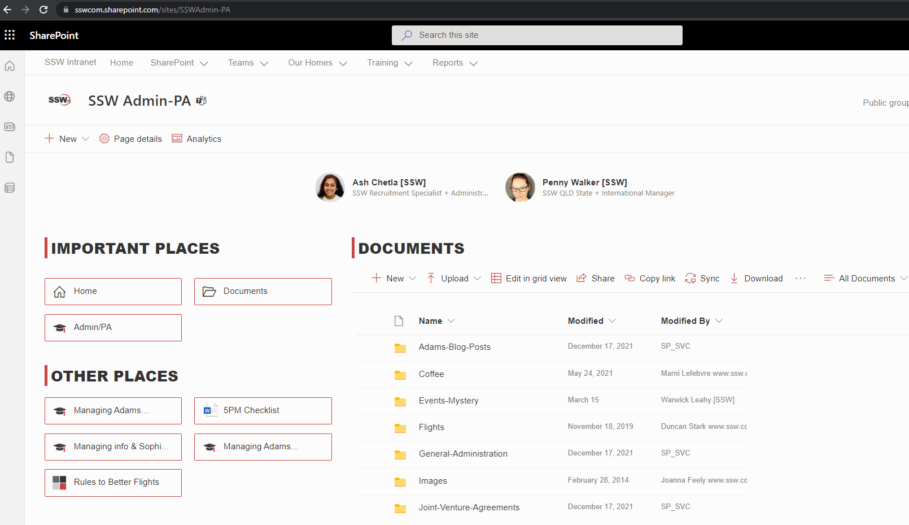

It's important for all your SharePoint Sites to be as consistent as possible. This helps users' navigation through new pages as they know exactly where to look.

`youtube:https://www.youtube.com/embed/Wf9o6jGhXJI`

<!--endintro-->

Following these simple rules makes this really easy:

1. Put your preferred navigation in the same place (usually on the left-hand side)
2. Keep the headings consistent
3. Use icons for each type of link, so users easily know what to expect when clicking on a link (E.g. A Microsoft Word document is going to open a Word document) Aldo, a link to "Home" looks the same on every page.

### Navigation consistency between pages

::: bad

:::

::: good

:::

### Headings and icons consistency within a page

::: bad

:::

::: good

:::
