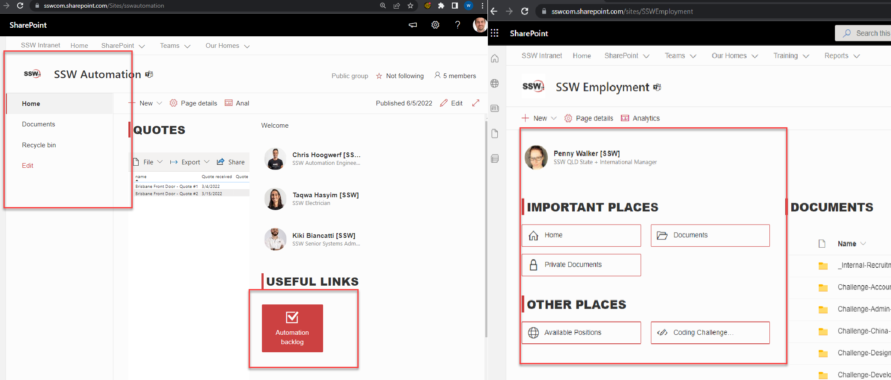
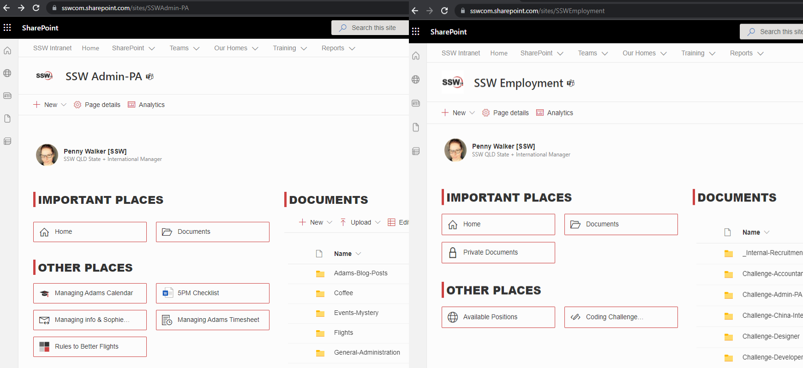
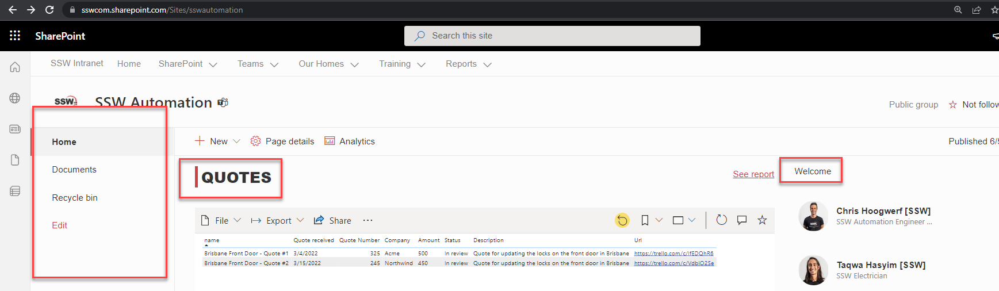
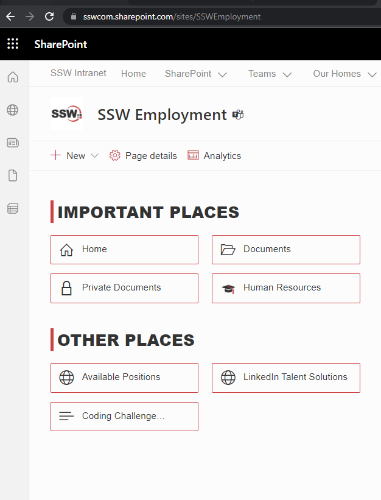

It's important for all your SharePoint Sites to be as consistent as possible. This helps users' navigation through new pages as they know exactly where to look.

`youtube: https://www.youtube.com/embed/U3l7QCVJIt8`

<!--endintro-->

Following some simple rules makes this really easy.  

1. Always put any navigation in the same place
2. Use the same icons for the same types of items, so that a link to "Home" looks the same on each page. Or a user knows when they click on a link with a Word icon, a Microsoft Word document is going to open.
::: bad

:::

::: good

:::

::: bad

:::

::: good

:::