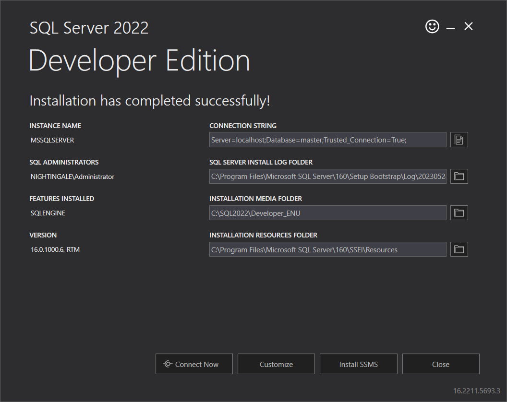

Often, developers jump onto a new project only to realize they can't get the SQL Server instance running, or the SQL Server setup doesn't work with their machine.

Even if they are able to install SQL Server, developers have a better option with a smaller footprint on their dev machine. Containers give them the ability to work on multiple projects with different clients. In a word "Isolation" baby!

Using Docker to run SQL Server in a container resolves common problems and provides numerous benefits:  

<!--endintro-->

`youtube: fFpDf5si_Hw`
**Video: Run SQL Server in Docker! (5 min)**

In the video, Jeff walks through how and why to run SQL in a container. However, you should not use the Docker image he chose to use in the video. 

For SQL Server with Docker you have a couple of choices being:
* **Azure-Sql-Edge** - `mcr.microsoft.com/azure-sql-edge` (recommended)
* **Microsoft SQL Server** - `mcr.microsoft.com/mssql/server` 

::: info
**Warning:** If you have an ARM chip, the Docker image in the video is not for you. Instead use "Azure-Sql-Edge"
:::

## Benefits

✅ **Isolation:** Docker enables you to create separate networks with SQL Server and control access, allowing for multiple instances on a single PC. More importantly if you are a consultant and work on different projects, you need this

✅ **Fast to get Ready to Run (without installing):** Docker eliminates the need for repetitive and mundane configuration tasks, speeding up your SQL Server setup. This is especially beneficial for a CI/CD pipeline

✅ **Testing Flexibility:** Docker allows for testing against different versions of SQL Server simply by changing an image tag or SQL Server type in the environment variable

✅ **Resetting for Testing:** The contents of the image are immutable meaning that it is easy to remove the container, and spin up a new one with the original state. In short, Docker provides the ability to easily reset all changes for fresh testing scenarios

✅ **Transparent Configuration:** Docker provides clear and explicit configuration steps in the Dockerfile and docker-compose.yml

✅ **Cross-Platform:** These days developers in a team have different Operating Systems. The Docker engine runs on many operating systems, making it ideal for diverse development environments

::: bad

:::

::: good

:::

Now you've done this, the next step is to [containerize the entire project](/dev-containers).
