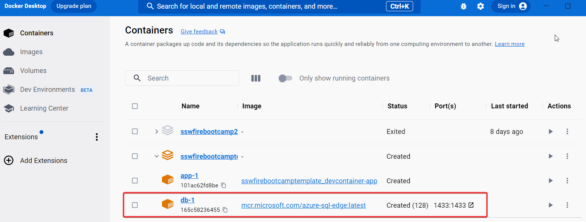

Often, developers jump onto a new project only to realise they can't get the SQL Server instance running, or the SQL Server setup doesn't work with their machine.

Using Docker to run SQL Server in a container resolves this problem and provides numerous benefits.  

xxx yyyy   Tiago 

<!--endintro--> 

`youtube: fFpDf5si_Hw`
**Video: Jeff walks through how and why to run SQL in a container**

Note: If you have an ARM chip, the Docker image in the video is not for you 🙁
You will need to use "Azure-Sql-Edge" (mcr.microsoft.com/azure-sql-edge)

## Benefits

✅ **Fast and Automatic Installation:** Docker eliminates the need for repetitive and mundane configuration tasks, speeding up your SQL Server setup. This is especially beneficial for a CI/CD pipeline

✅ **Cloud-Ready:** Docker allows your SQL Server solution to be run on various platforms, making it cloud-ready and portable

✅ **Testing Flexibility:** Docker allows for testing against different versions of SQL Server simply by changing an image tag or SQL Server type in the environment variable

✅ **Isolation:** Docker enables you to create separate networks with SQL Server and control access, allowing for multiple instances on a single PC

✅ **Resetting for Testing:** Docker provides the ability to easily reset all changes for fresh testing scenarios

✅ **Transparent Configuration:** Docker provides clear and explicit configuration steps in the Dockerfile and docker-compose.yml

✅ **Cross-Platform:** Docker configurations are compatible with any operating system, making it ideal for diverse development environments

::: bad

:::

::: good

:::